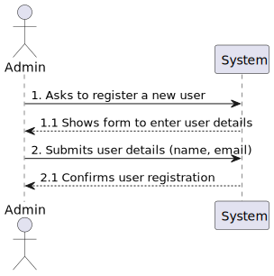
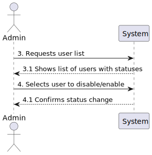

# US1000 - As Administrator, I want to be able to register, disable/enable, and list users of the backoffice

## 1. Requirements Engineering

### 1.1. User Story Description

As Administrator, I want to be able to register, disable/enable, and list users of the backoffice to manage user access and permissions efficiently.

### 1.2. Customer Specifications and Clarifications

- **Question**: Can a user (from the backoffice, for example) be enabled/disabled multiple times?
- **Answer**: Yes, a user can be enabled or disabled multiple times as needed.

- **Question**: Can there be more than one administrator of the backoffice?
- **Answer**: One administrator is enough for managing the backoffice.

- **Question**: What information about the backoffice users need to be registered?
- **Answer**: The information required includes the user's email as the identifier and the name. Specific details on password generation were not provided but mentioned in another context (US2000a) suggesting that the system could generate passwords for new users.

### 1.3. Acceptance Criteria

- **Registration**: Users can be registered with at least their email and name.
- **Disable/Enable Functionality**: Users can be disabled or enabled multiple times.
- **Listing Users**: Administrators can list all users with their current status.

### 1.4. Found out Dependencies

- Dependent on an authentication system for managing passwords and user sessions.

### 1.5 Input and Output Data

- **Input**: User's name and email.
- **Output**: Confirmation of user registration, status updates, and a list of users with their statuses.

### 1.6. System Sequence Diagram (SSD)

### 1.7 Other Relevant Remarks

- The functionality should ensure that the registration process includes generating a secure password if this is not provided by the user.

## 2. OO Analysis

### 2.1. Relevant Domain Model Excerpt 

- The domain model should include classes such as `User`, `Admin`, and `UserStatus`.

### 2.2. Other Remarks

- None

## 3. Design - User Story Realization

### 3.1. Rationale

| Interaction ID | Question: Which class is responsible for... | Answer  | Justification (with patterns)  |
|:-------------  |:--------------------- |:------------|:---------------------------- |
| Step 1  		 |							 |             |                              |
| Step 2  		 |							 |             |                              |
| Step 3  		 |							 |             |                              |
| Step 4  		 |							 |             |                              |
| Step 5  		 |							 |             |                              |
| Step 6  		 |							 |             |                              |              
| Step 7  		 |							 |             |                              |
| Step 8  		 |							 |             |                              |
| Step 9  		 |							 |             |                              |
| Step 10  		 |							 |             |                              |  

### 3.2. Sequence Diagram (SD)

### 3.3. Class Diagram (CD)

## 4. Tests 

## 5. Construction (Implementation)

## 6. Integration and Demo 

## 7. Observations

