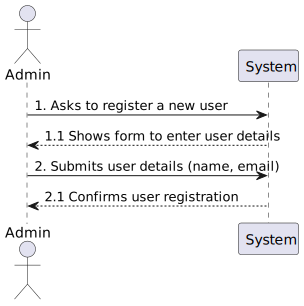

# US1000 - As Administrator, I want to be able to register, disable/enable, and list users of the backoffice

## 1. Requirements Engineering

### 1.1. User Story Description

As Administrator, I want to be able to register, disable/enable, and list users of the backoffice to manage user access and permissions efficiently.

### 1.2. Customer Specifications and Clarifications

> **Question:** Na criação de um utilizador no sistema o nome é definido pelo utilizador ou é o nome da pessoa (primeiro e último) e se a password é definida pelo utilizador ou gerada pelo sistema?
>
> **Answer:** No âmbito da US 2000a o Operator cria utilizadores do sistema para candidatos que ainda não estejam no sistema. Tem de fazer isso com base nos dados recebidos na candidatura (que incluem email e nome). O email servirá para identificar a pessoa. Neste contexto é necessário ter uma password para esse novo utilizador. Uma vez que essa informação não é transmitida pelo candidato, suponho que a solução mais “aconselhada” será o sistema gerar uma password para esse utilizador. Como o utilizador/candidato irá receber essa informação (a forma de autenticação na app) está out of scope, no sentido em que não existe nenhuma US que remete para isso. As **US 1000** e 1001 também remetem para criação de utilizadores. Aqui, eventualmente poderia-se pensar em introduzir manualmente as passwords, mas pode ser pelo mesmo mecanismo de definição automática de password, descrito anteriormente.

> **Question:** Can a user (from the backoffice, for example) be enabled/disabled multiple times?
>
> **Answer:** Yes.

> **Question:** Information about the users - Based on the user story description: "As Administrator, I want to be able to register, disable/enable, and list users of the backoffice.", I have the following questions: 1 - Can there be more than one admnistrator of the backoffice? 2 - What information about the backoffice users need to be registered?
>
> **Answer:** Regarding question 1, one admin is enough. Regarding question 2, see Q11.

> **Question:** Editar dados de utilizador – É possível alterar os dados de qualquer utilizador (Customer manager, Customer, Candidate), depois de este ter sido criado? Se sim, que dados são passiveis de ser alterados? Cada utilizador que é criado, tem como estado "activo" por defeito?
>
> **Answer:** Não irei responder diretamente à questão. O product owner considera que devem usar as melhores práticas quando a esse assunto.

> **Question:** Em relação ao registro de utilizadores, todos estes devem ser considerados por padrão "enable" ou deve haver a opção de "enable/disable" os utilizadores durante o processo de registro?
>
> **Answer:** No contexto da US1000 deve ser possível ativar e desativar utilizadores. Suponho que por omissão devem estar ativos.

> **Question:** A mudança de estado é referente ao candidato ou à candidatura individual e como se relaciona com o enable/disable dos utilizadores?
>
> **Answer:** O enable/disable dos users é apenas para controlar os acessos ao sistema. O estado, no processo de candidatura, é o estado da candidatura de um candidato a um job opening, não está diretamente relacionado com o enable/disable dos users.

### 1.3. Acceptance Criteria

- **Registration**: Users can be registered with at least their email and name.
- **Disable/Enable Functionality**: Users can be disabled or enabled multiple times.
- **Listing Users**: Administrators can list all users with their current status.
- 
### 1.4. Found out Dependencies

- Dependent on an authentication system for managing passwords and user sessions.

### 1.5 Input and Output Data

- **Input**: User's name and email.
- **Output**: Confirmation of user registration, status updates, and a list of users with their statuses.

### 1.6. System Sequence Diagram (SSD)

### 1.7 Other Relevant Remarks

- The functionality should ensure that the registration process includes generating a secure password if this is not provided by the user.

## 2. OO Analysis

### 2.1. Relevant Domain Model Excerpt 

### 2.2. Other Remarks

- None

## 3. Design - User Story Realization

### 3.1. Rationale

| Interaction ID | Question: Which class is responsible for...          | Answer                     | Justification (with patterns)      |
|----------------|-------------------------------------------------|-------------------------|----------------------------------|
| Step 1          | Requests list of active users                     | DeactivateUserUI        | According to the sequence diagram, the UI is responsible for handling requests from the Admin to display the list of active users.               |
| Step 2          | Checks if the user is an ADMIN                     | DeactivateUserController | The Controller checks authorization by calling the AuthorizationService to ensure the user has the necessary permissions. |
| Step 3          | Requests list of active users                     | DeactivateUserController | After obtaining authorization, the Controller requests the list of active users from the UserManagementService. |
| Step 4          | Returns list of active users                       | UserManagementService   | The Service is responsible for providing the list of active users to the Controller.                      |
| Step 5          | Sends list of active users                         | DeactivateUserController | The Controller sends the list back to the UI for display.                                       |
| Step 6          | Displays list of active users                      | DeactivateUserUI        | The UI displays the list of active users to the Admin.                                                    |
| Step 7          | Selects a user to deactivate                       | DeactivateUserUI        | The UI handles the selection of the user to deactivate.                                                         |
| Step 8          | Requests deactivation of the selected user         | DeactivateUserController | The Controller processes the deactivation request.                                                       |
| Step 9          | Deactivates the user                                | UserManagementService   | The Service performs user deactivation.                                                                   |
| Step 10         | Confirms deactivation                              | DeactivateUserUI        | The UI confirms deactivation to the Admin after receiving confirmation from the Controller.                |

| Interaction ID | Question: Which class is responsible for...          | Answer                    | Justification (with patterns)      |
|----------------|-------------------------------------------------|------------------------|----------------------------------|
| Step 1          | Request to view all users                       | ListUsersUI             | The UI is responsible for receiving the Admin's request to view all users.               |
| Step 2          | Sends request to view all users                  | ListUsersController     | The Controller receives the request from the UI to view all users. |
| Step 3          | Checks if the user is an ADMIN                    | ListUsersController     | The Controller checks whether the user has ADMIN permissions using the AuthorizationService.  |
| Step 4          | Authorization confirmed                           | AuthorizationService    | The AuthorizationService is responsible for confirming authorization.                     |
| Step 5          | Requests list of all users                        | ListUsersController     | The Controller requests the list of all users from the UserManagementService.  |
| Step 6          | Returns list of all users                          | UserManagementService   | The UserManagementService returns the list of all users to the Controller.             |
| Step 7          | Sends list of all users to UI                      | ListUsersController     | The Controller sends the list of all users to the UI for display.              |
| Step 8          | Displays list of all users with current status     | ListUsersUI             | The UI displays the list of all users with their current status to the Admin.              |

| Interaction ID | Question: Which class is responsible for...           | Answer                    | Justification (with patterns)      |
|----------------|-------------------------------------------------|------------------------|----------------------------------|
| Step 1          | Ask to register a new user                        | AddUserUI              | The UI handles the initial request from the Administrator to register a new user. |
| Step 2          | Shows form to enter user details                   | AddUserUI              | The UI displays the form for entering the new user's details.                        |
| Step 3          | Submits user details for registration               | AddUserUI              | The UI receives the submitted user details and sends them to the Controller.        |
| Step 4          | Sends user details for registration                | AddUserController       | The Controller receives the user details from the UI to begin registration.         |
| Step 5          | Ensures Admin has the required roles                | AddUserController       | The Controller checks if the Administrator has the necessary roles using AuthorizationService.  |
| Step 6          | Authorization confirmed                             | AuthorizationService   | The AuthorizationService confirms that the Administrator has the required roles.  |
| Step 7          | Registers new user with provided details            | AddUserController       | After authorization, the Controller registers the new user with UserManagementService. |
| Step 8          | User registration successful                        | UserManagementService  | UserManagementService is responsible for successfully registering the new user.    |
| Step 9          | User added successfully                              | AddUserController       | The Controller receives the successful registration response from the Service.      |
| Step 10         | Confirms user registration successful                | AddUserUI               | The UI confirms successful registration to the Administrator.                        |

### 3.2. Sequence Diagram (SD)

### 3.3. Class Diagram (CD)

## 4. Tests 

## 5. Construction (Implementation)

## 6. Integration and Demo 

## 7. Observations

