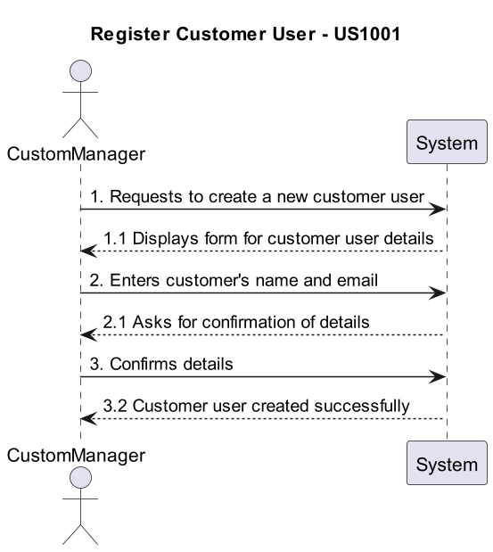
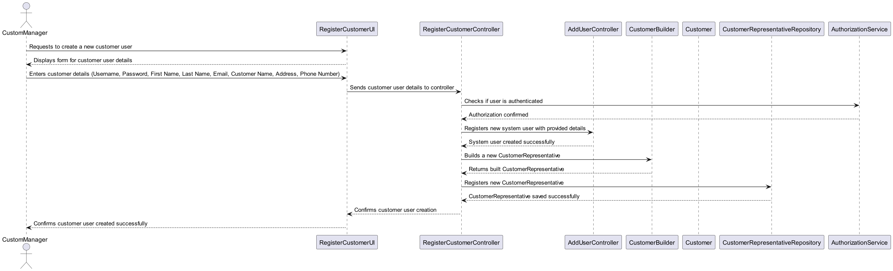

# US1001 - As a Custom Manager, I want to create a Customer User

## 1. Requirements Engineering

### 1.1. User Story Description

As a Custom Manager, I want to create a customer user in the system to allow customers to access the customer app.

### 1.2. Customer Specifications and Clarifications

- **Question**: When registering a customer, are we only registering the data of the customer or also the data of the user who manages the app? Should we consider the possibility that the Customer User who manages the app changes and we should save the data of the old user too?
- **Answer**: This US primarily focuses on registering a customer. A user for the customer is also created to access the app, but tracking changes to the user who manages the app is out of scope for this US.

- **Question**: Is the creation of a customer account done by manually inserting the email and name of the customer, or is there an expectation to have a list of unregistered customers in the system to choose from?
- **Answer**: There is no concept of unregistered customers. The customer must be registered by manually entering their details, including email, to create a user account.

- **Question**: Should the customer manager define a password for this user, or should it be generated by the system?
- **Answer**: The password for the customer user should be generated by the system as per the mechanism described previously.

- **Question**: What are the business rules for the customer's address?
- **Answer**: For now, the system should accept national addresses only.

- **Question**: Is it correct to assume that the customer is automatically assigned to the customer manager who registered them?
- **Answer**: Yes, we will assume that the customer is automatically assigned to the customer manager who registered them.

- **Question**: In the process of creating a User through the Customer entity created, is it permitted to request an email from the Manager to be associated with the entity?
- **Answer**: The Customer Manager is expected to know and provide the email to be used for the customer. The password will be generated automatically by the system.

### 1.3. Acceptance Criteria

- Successfully create a customer user with an email and name provided by the Customer Manager.
- System-generated password for customer user ensuring security.
- Automatically assign the created customer to the Customer Manager who registered them.
- Confirmation that the customer user has been successfully created and is able to access the customer app.

### 1.4. Found out Dependencies

- Integration with a secure authentication system for managing passwords and user sessions.
- The system should support national addresses initially, as per the current scope.

### 1.5 Input and Output Data

- **Input**: Customer's name, email.
- **Output**: Confirmation of customer user creation, system-generated password.

### 1.6. System Sequence Diagram (SSD)

### 1.7 Other Relevant Remarks

- Consideration for future enhancements could include support for international addresses and tracking changes to the customer manager.

## 2. OO Analysis

### 2.1. Relevant Domain Model Excerpt

- Classes such as `Customer`, `User`, `EmailAddress`, `Password` will be relevant for this user story.

### 2.2. Other Remarks

- None

## 3. Design - User Story Realization

### 3.1. Rationale

| Interaction ID | Question: Which class is responsible for...        | Answer                   | Justification (with patterns)                                                                                  |
|----------------|-------------------------------------------------|-------------------------|------------------------------------------------------------------------------------------------------------|
| Step 1          | Requests to create a new customer user             | RegisterCustomerUI      | The UI is responsible for receiving the request from the CustomManager to create a new customer user.          |
| Step 2          | Displays form for customer user details             | RegisterCustomerUI      | The UI displays the form for CustomManager to enter customer user details.                                    |
| Step 3          | Enters customer details (Username, Password, etc.)   | CustomManager           | The CustomManager provides customer user details to the UI.                                                     |
| Step 4          | Sends customer user details to the controller        | RegisterCustomerUI      | The UI sends the customer user details to the controller for further processing.                               |
| Step 5          | Checks if user is authenticated                       | RegisterCustomerController | The Controller calls the AuthorizationService to check if the user is authenticated.                           |
| Step 6          | Authorization confirmed                               | AuthorizationService   | The AuthorizationService confirms that the user is authenticated.                                            |
| Step 7          | Registers new system user                             | AddUserController       | The AddUserController registers a new system user based on the provided details.                               |
| Step 8          | System user created successfully                      | AddUserController       | The AddUserController confirms successful creation of the system user.                                       |
| Step 9          | Builds a new Customer Representative                   | RegisterCustomerController | The Controller calls the CustomerBuilder to create a new Customer Representative.                            |
| Step 10         | Returns built Customer Representative                   | CustomerBuilder         | The CustomerBuilder returns the newly created Customer Representative to the controller.                     |
| Step 11         | Registers new Customer Representative                   | RegisterCustomerController | The Controller registers the new Customer Representative in the CustomerRepresentativeRepository.           |
| Step 12         | CustomerRepresentative saved successfully                | CustomerRepresentativeRepository | The CustomerRepresentativeRepository confirms successful registration of the new Customer Representative.   |
| Step 13         | Confirms customer user creation                         | RegisterCustomerController | The Controller informs the UI of the successful creation of the customer user.                                 |
| Step 14         | Confirms customer user creation                         | RegisterCustomerUI      | The UI confirms to the CustomManager that the customer user was created successfully.                           |

### 3.2. Sequence Diagram (SD)

### 3.3. Class Diagram (CD)

- Shows classes like `CustomerManager`, `Customer`, `AuthenticationService`, and their relationships.

## 4. Tests 

## 5. Construction (Implementation)

## 6. Integration and Demo 

## 7. Observations

