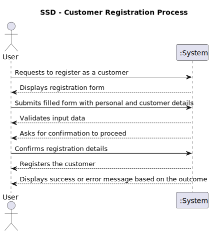

# US1001 - As a Custom Manager, I want to create a Customer User

## 1. Requirements Engineering

### 1.1. User Story Description

As a Custom Manager, I want to create a customer user in the system to allow customers to access the customer app.

### 1.2. Customer Specifications and Clarifications

- **Question**: When registering a customer, are we only registering the data of the customer or also the data of the user who manages the app? Should we consider the possibility that the Customer User who manages the app changes and we should save the data of the old user too?
- **Answer**: This US primarily focuses on registering a customer. A user for the customer is also created to access the app, but tracking changes to the user who manages the app is out of scope for this US.

- **Question**: Is the creation of a customer account done by manually inserting the email and name of the customer, or is there an expectation to have a list of unregistered customers in the system to choose from?
- **Answer**: There is no concept of unregistered customers. The customer must be registered by manually entering their details, including email, to create a user account.

- **Question**: Should the customer manager define a password for this user, or should it be generated by the system?
- **Answer**: The password for the customer user should be generated by the system as per the mechanism described previously.

- **Question**: What are the business rules for the customer's address?
- **Answer**: For now, the system should accept national addresses only.

- **Question**: Is it correct to assume that the customer is automatically assigned to the customer manager who registered them?
- **Answer**: Yes, we will assume that the customer is automatically assigned to the customer manager who registered them.

- **Question**: In the process of creating a User through the Customer entity created, is it permitted to request an email from the Manager to be associated with the entity?
- **Answer**: The Customer Manager is expected to know and provide the email to be used for the customer. The password will be generated automatically by the system.

### 1.3. Acceptance Criteria

- Successfully create a customer user with an email and name provided by the Customer Manager.
- System-generated password for customer user ensuring security.
- Automatically assign the created customer to the Customer Manager who registered them.
- Confirmation that the customer user has been successfully created and is able to access the customer app.

### 1.4. Found out Dependencies

- Integration with a secure authentication system for managing passwords and user sessions.
- The system should support national addresses initially, as per the current scope.

### 1.5 Input and Output Data

- **Input**: userData, customerData, phoneNumber
- **Output**: Confirmation of customer user creation, system-generated password.

### 1.6. System Sequence Diagram (SSD)

### 1.7 Other Relevant Remarks

- Consideration for future enhancements could include support for international addresses and tracking changes to the customer manager.

## 2. OO Analysis

### 2.1. Relevant Domain Model Excerpt

### 2.2. Other Remarks

- None

## 3. Design - User Story Realization

### 3.1. Rationale

| Interaction ID                                                       | Question: Which class is responsible for...                    | Answer                                | Justification (with patterns)                                                                                             |
|:---------------------------------------------------------------------|:---------------------------------------------------------------|:--------------------------------------|:--------------------------------------------------------------------------------------------------------------------------|
| **Step 1**: User initiates the customer registration                 | ... interacting with the actor?                                | `RegisterCustomerUI`                  | **Pure Fabrication**: Manages user interaction and is not part of the domain model.                                        |
|                                                                      | ... coordinating the US?                                       | `RegisterCustomerController`          | **Controller**: Orchestrates the registration process based on user input.                                                 |
| **Step 2**: UI collects user input                                   | ... handling user input validation and formatting?             | `RegisterCustomerUI`                  | **Pure Fabrication**: Handles data input and ensures that it conforms to expected formats.                                 |
| **Step 3**: Controller registers the customer                        | ... processing the customer creation request?                  | `RegisterCustomerController`          | **Controller**: Processes the input data and commands other systems to act upon this data.                                 |
|                                                                      | ... creating the system user object?                           | `AddUserController`                   | **Service**: Manages user-related operations, such as creating new system users.                                           |
| **Step 4**: Building the customer representative                     | ... assembling customer representative details?                | `CustomerBuilder`                     | **Creator**: Responsible for constructing a complex `CustomerRepresentative` object from provided components.              |
| **Step 5**: Persisting the customer representative                   | ... saving the new customer representative?                    | `CustomerRepresentativeRepository`    | **Information Expert**: Manages persistence, specifically saving customer representatives.                                 |
| **Step 6**: Confirmation is shown to the user                        | ... informing operation success?                               | `RegisterCustomerUI`                  | **Pure Fabrication**: Responsible for showing success or failure messages to the user.                                    |

### 3.2. Sequence Diagram (SD)

### 3.3. Class Diagram (CD)

## 4. Tests 

## 5. Construction (Implementation)

## 6. Integration and Demo 

## 7. Observations

