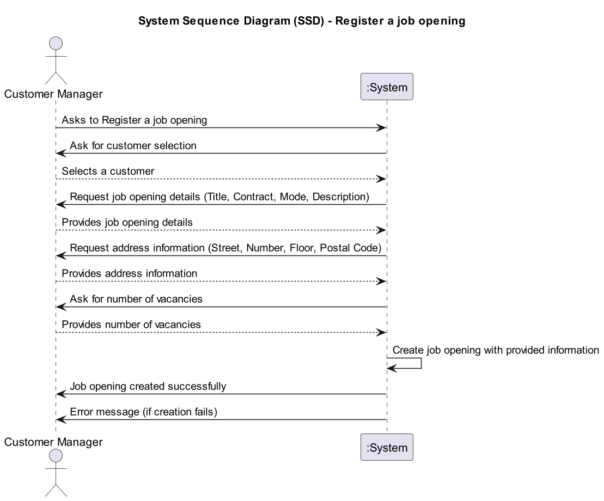
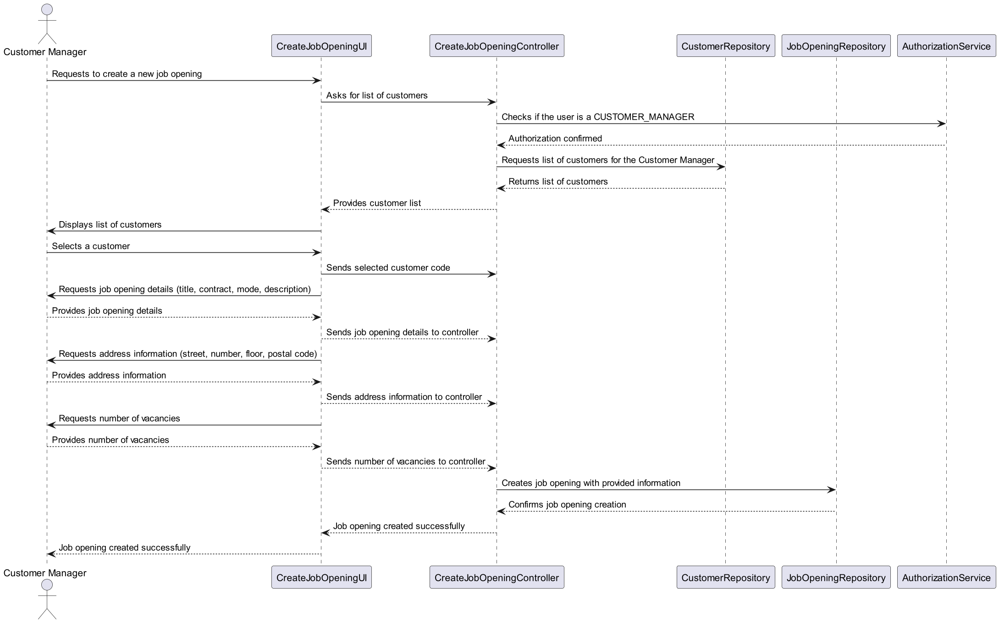

# US1002 - As Customer Manager, I want to register a job opening

## 1. Requirements Engineering

### 1.1. User Story Description

As a Customer Manager, I want to register a job opening to enable the recruitment process for new positions within the company.

### 1.2. Customer Specifications and Clarifications

- **Question**: How are the requirements for a job offer selected or defined?
- **Answer**: The Customer Manager registers a job opening and then selects the appropriate requirements specification that was previously created by a Language Engineer and registered in the system.

- **Question**: Could we use the same interview model for more than one job opening?
- **Answer**: Yes, the same interview model can be used for multiple job openings.

- **Question**: When registering a job offer, does the Customer Manager create the requirement specifications and interview models, or is there a list from which they select?
- **Answer**: The creation of interview models and requirement specifications is handled in specific use cases under US1009 and US1011. The Customer Manager selects from these for a job opening.

### 1.3. Acceptance Criteria

- The Customer Manager can register a job opening using predefined requirements specifications or he can add it later.

- Job openings must be associated with a customer, which the Customer Manager can select from those they manage.

### 1.4. Found out Dependencies

### 1.5 Input and Output Data

- **Input**: Job title, number of vacancies, job description, contract type, mode of work, and selection of requirements specifications.

- **Output**: Confirmation of the registered job opening, including details of the job and its associated specifications.

### 1.6. System Sequence Diagram (SSD)

### 1.7 Other Relevant Remarks

## 2. OO Analysis

### 2.1. Relevant Domain Model Excerpt

### 2.2. Other Remarks

- None

## 3. Design - User Story Realization

### 3.1. Rationale

| Interaction ID | Question: Which class is responsible for...          | Answer                      | Justification (with patterns)              |
|----------------|-------------------------------------------------|----------------------------|-------------------------------------------|
| Step 1          | Requests to create a new job opening               | CreateJobOpeningUI         | The UI is responsible for receiving the request from the Customer Manager to create a new job opening. |
| Step 2          | Asks for a list of customers                        | CreateJobOpeningUI         | The UI handles the request for a list of customers from the Customer Manager. |
| Step 3          | Checks if the user is a CUSTOMER_MANAGER            | CreateJobOpeningController | The Controller checks if the user is authorized by calling the AuthorizationService. |
| Step 4          | Authorization confirmed                             | AuthorizationService       | The AuthorizationService confirms that the user has the necessary roles. |
| Step 5          | Requests list of customers for the Customer Manager | CreateJobOpeningController | The Controller sends a request for the list of customers to the CustomerRepository. |
| Step 6          | Returns list of customers                           | CustomerRepository         | The CustomerRepository provides the list of customers to the Controller. |
| Step 7          | Provides customer list                              | CreateJobOpeningController | The Controller sends the list of customers to the UI for display. |
| Step 8          | Displays list of customers                          | CreateJobOpeningUI         | The UI displays the list of customers to the Customer Manager. |
| Step 9          | Selects a customer                                  | CreateJobOpeningUI         | The UI handles the selection of a customer by the Customer Manager. |
| Step 10         | Sends selected customer code                         | CreateJobOpeningController | The Controller receives the selected customer code from the UI. |
| Step 11         | Requests job opening details (title, contract, mode, description) | CreateJobOpeningUI | The UI prompts the Customer Manager to provide job opening details. |
| Step 12         | Provides job opening details                         | Customer Manager           | The Customer Manager provides the requested job opening details to the UI. |
| Step 13         | Sends job opening details to the controller           | CreateJobOpeningUI         | The UI sends the job opening details to the Controller. |
| Step 14         | Requests address information (street, number, floor, postal code) | CreateJobOpeningUI | The UI requests the address information from the Customer Manager. |
| Step 15         | Provides address information                          | Customer Manager           | The Customer Manager provides the requested address information to the UI. |
| Step 16         | Sends address information to the controller           | CreateJobOpeningUI         | The UI sends the address information to the Controller. |
| Step 17         | Requests number of vacancies                           | CreateJobOpeningUI         | The UI asks the Customer Manager for the number of vacancies. |
| Step 18         | Provides number of vacancies                          | Customer Manager           | The Customer Manager provides the requested number of vacancies to the UI. |
| Step 19         | Sends number of vacancies to the controller            | CreateJobOpeningUI         | The UI sends the number of vacancies to the Controller. |
| Step 20         | Creates job opening with provided information          | CreateJobOpeningController | The Controller sends the job opening information to the JobOpeningRepository for creation. |
| Step 21         | Confirms job opening creation                          | JobOpeningRepository       | The JobOpeningRepository confirms the successful creation of the job opening. |
| Step 22         | Job opening created successfully                      | CreateJobOpeningController | The Controller receives the confirmation from the JobOpeningRepository. |

### 3.2. Sequence Diagram (SD)

### 3.3. Class Diagram (CD)

## 4. Tests 

## 5. Construction (Implementation)

## 6. Integration and Demo 

## 7. Observations

