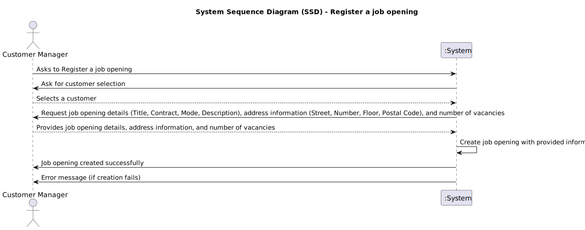
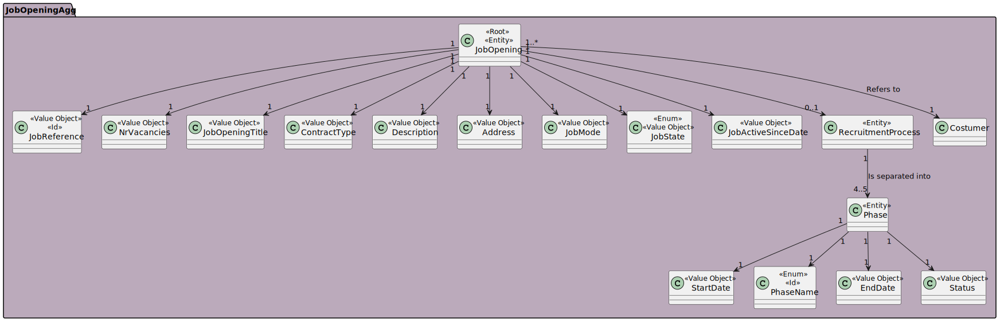
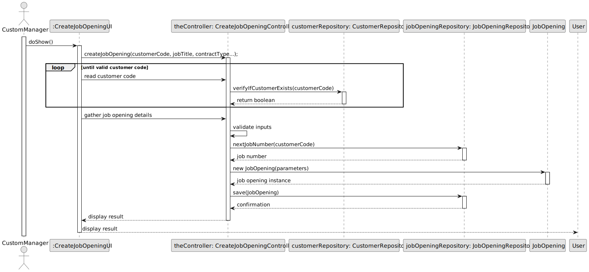
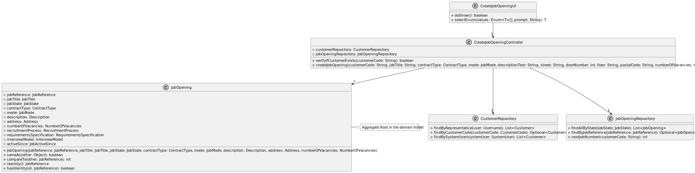

# US1002 - As Customer Manager, I want to register a job opening

## 1. Requirements Engineering

### 1.1. User Story Description

As a Customer Manager, I want to register a job opening to enable the recruitment process for new positions within the company.

### 1.2. Customer Specifications and Clarifications

- **Question**: How are the requirements for a job offer selected or defined?
- **Answer**: The Customer Manager registers a job opening and then selects the appropriate requirements specification that was previously created by a Language Engineer and registered in the system.

- **Question**: Could we use the same interview model for more than one job opening?
- **Answer**: Yes, the same interview model can be used for multiple job openings.

- **Question**: When registering a job offer, does the Customer Manager create the requirement specifications and interview models, or is there a list from which they select?
- **Answer**: The creation of interview models and requirement specifications is handled in specific use cases under US1009 and US1011. The Customer Manager selects from these for a job opening.

### 1.3. Acceptance Criteria

- The Customer Manager can register a job opening using predefined requirements specifications or he can add it later.

- Job openings must be associated with a customer, which the Customer Manager can select from those they manage.

### 1.4. Found out Dependencies

### 1.5 Input and Output Data

- **Input**: Job title, number of vacancies, job description, contract type, mode of work, and selection of requirements specifications.

- **Output**: Confirmation of the registered job opening, including details of the job and its associated specifications.

### 1.6. System Sequence Diagram (SSD)

### 1.7 Other Relevant Remarks

## 2. OO Analysis

### 2.1. Relevant Domain Model Excerpt

### 2.2. Other Remarks

- None

## 3. Design - User Story Realization

### 3.1. Rationale

# Rationale for Job Opening Creation Process

The following table outlines the responsibilities of each class involved in the job opening creation process, based on the final sequence diagram provided.

| Interaction ID | Question: Which class is responsible for... | Answer | Justification (with patterns) |
|----------------|--------------------------------------------|--------|-------------------------------|
| **Step 1**: CustomManager initiates job opening creation | ... interacting with the actor? | `CreateJobOpeningUI` | **Pure Fabrication**: Manages user interaction and is not part of the domain model. |
|  | ... coordinating the use case? | `CreateJobOpeningController` | **Controller**: Coordinates the process of job opening creation based on user input. |
| **Step 2**: Validate and gather job opening details | ... handling user input validation and formatting? | `CreateJobOpeningUI` | **Pure Fabrication**: Handles data input and ensures that it conforms to expected formats. |
|  | ... processing the job opening creation request? | `CreateJobOpeningController` | **Controller**: Processes the input data and commands other systems to act upon this data. |
| **Step 3**: Job opening is created and saved | ... creating the job opening object? | `JobOpening` | **Creator**: Responsible for constructing the job opening entity with the provided parameters. |
|  | ... verifying customer existence? | `CustomerRepository` | **Information Expert**: Directly accesses the data storage to fetch customer details. |
|  | ... determining the next job number? | `JobOpeningRepository` | **Information Expert**: Manages the retrieval of job-related data, including generating the next job number. |
| **Step 4**: Confirmation is displayed to the CustomManager | ... saving the new job opening? | `JobOpeningRepository` | **Information Expert**: Responsible for managing persistence, such as saving job openings. |
|  | ... informing operation success? | `CreateJobOpeningUI` | **Pure Fabrication**: Responsible for showing success or failure messages to the user. |

This rationale provides a clear view of the roles and responsibilities of each class in the job opening creation process, aligning with the sequence diagram interactions.

### 3.2. Sequence Diagram (SD)

### 3.3. Class Diagram (CD)

## 4. Tests 

## 5. Construction (Implementation)

## 6. Integration and Demo 

## 7. Observations

