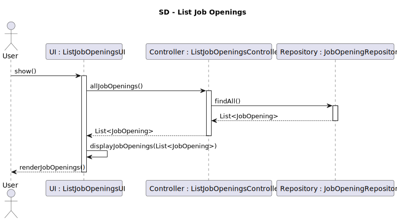

# US1003 - As Customer Manager, I want to list job openings

## 1. Requirements Engineering

### 1.1. User Story Description

As a Customer Manager, I want to list job openings to efficiently manage and review the recruitment processes associated with my responsibilities.

### 1.2. Customer Specifications and Clarifications

- **Question**: Is there a criterion for defining which job openings to list? Are we listing all openings in the system?
- **Answer**: It would be useful to filter job openings by customer and date. It's also practical to filter by active job openings as well as potentially listing all job openings.

- **Question**: How will the Customer Manager filter job openings by customer, and what about the date?
- **Answer**: The Customer Manager can filter job openings by customer using the customer's name or customer code. As for the date filter, it might be logical to allow searching for job openings by specific dates or within a date range.

- **Question**: When does a job opening become active? Is it when it's created with a set of requirements or when linked to an ongoing recruitment process?
- **Answer**: A job opening is considered active as long as its recruitment process has not concluded.

- **Question**: Can a Customer Manager list all job openings or only those assigned to them?
- **Answer**: It makes sense for a Customer Manager to only list job openings that are assigned to them.

### 1.3. Acceptance Criteria

- The system provides functionality to filter job openings by customer name or code.

- Job openings are listed with their current status, distinguishing between active and inactive states based on the recruitment process.

### 1.4. Found out Dependencies

US1002 - As Customer Manager, I want to register a job opening

### 1.5 Input and Output Data

- **Input**: Customer name/code, Status
- **Output**: List of job openings that match the specified filters.

### 1.6. System Sequence Diagram (SSD)

### 1.7 Other Relevant Remarks

- Future enhancements may include more dynamic filtering options to accommodate various user needs and improve the usability of the job opening listing feature.

## 2. OO Analysis

### 2.1. Relevant Domain Model Excerpt

- Classes such as `JobOpening`, `Customer`, will be relevant for this user story.

### 2.2. Other Remarks

- None

## 3. Design - User Story Realization

### 3.1. Rationale

# Rationale for Listing Job Openings Process

| Interaction ID | Question: Which class is responsible for... | Answer | Justification (with patterns) |
|----------------|--------------------------------------------|--------|-------------------------------|
| **Step 1**: User initiates job opening listing | ... interacting with the actor? | `ListJobOpeningsUI` | **Pure Fabrication**: Manages user interaction and is not part of the domain model. |
|  | ... coordinating the use case? | `ListJobOpeningsController` | **Controller**: Coordinates the process of listing job openings based on user input. |
| **Step 2**: Retrieve and process job openings | ... retrieving all job opening data? | `JobOpeningRepository` | **Information Expert**: Directly accesses the data storage to fetch all job opening details. |
|  | ... preparing the job openings data for display? | `ListJobOpeningsController` | **Controller**: Processes the retrieved data and prepares it for presentation. |
| **Step 3**: Display job openings to the user | ... presenting the list of job openings? | `ListJobOpeningsUI` | **Pure Fabrication**: Responsible for displaying the processed information to the user. |

This rationale provides a clear view of the roles and responsibilities of each class in the process of listing job openings, aligning with the interactions depicted in the sequence diagram.

### 3.2. Sequence Diagram (SD)

### 3.3. Class Diagram (CD)

## 4. Tests 

## 5. Construction (Implementation)

## 6. Integration and Demo 

## 7. Observations
