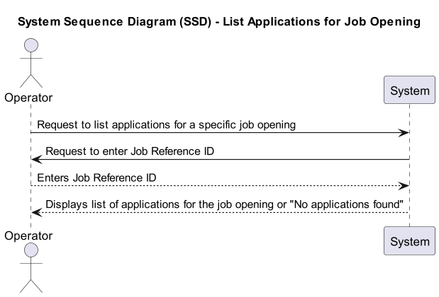
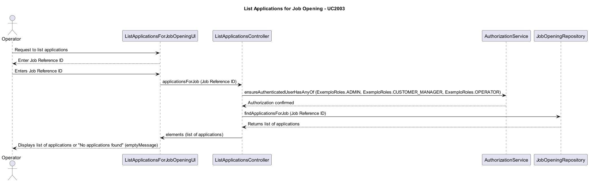

# US1005 - As Customer Manager, I want to list applications for a job opening

## 1. Requirements Engineering

### 1.1. User Story Description

As Customer Manager, I want to list all applications for a job opening.

### 1.2. Customer Specifications and Clarifications

- **Question**: Should the list include applications that are ongoing or can it include applications from the past?
- **Answer**: The list should show all applications, regardless of their state, for a job opening.

- **Question**: Can any application appear in the list or only those that have been accepted?
- **Answer**: All applications should be listed, not just those that have been accepted.

- **Question**: What information should be shown for each application?
- **Answer**: For each application, the candidate's identity and the state of their application should be displayed.

- **Question**: Should the list contain applications that have not yet completed the entire selection process defined in the setup of the Job Opening? If so, should the list contain the state/phase of each application?
- **Answer**: Yes, the list should include the state of the application to help the Customer Manager understand which applications have been rejected or are still in process.

- **Question**: How does the Customer Manager choose which job opening to list applications from?
- **Answer**: The Customer Manager should be able to select from all job openings they are responsible for.

### 1.3. Acceptance Criteria

- The system provides functionality to list all applications for a selected job opening.
- Applications can be filtered by their current state.

- The list includes detailed information about each application, including the candidate's name and the current state of their application.

### 1.4. Found out Dependencies

- **US1006**: Interaction with the system to fetch candidate details might be necessary.
- Dependency on the job opening management system for retrieving job openings the Customer Manager is responsible for.

### 1.5 Input and Output Data

- **Input**: Job opening selection (chosen from a list of job openings the Customer Manager is responsible for).
- **Output**: List of applications for the selected job opening, including candidate identification and application status.

### 1.6. System Sequence Diagram (SSD)

## 2. OO Analysis

### 2.1. Relevant Domain Model Excerpt

### 2.2. Other Remarks

- None

## 3. Design - User Story Realization

### 3.1. Rationale

| Interaction ID | Question: Which class is responsible for...           | Answer                   | Justification (with patterns)                                                                              |
|----------------|-------------------------------------------------|-------------------------|-----------------------------------------------------------------------------------------------------------|
| Step 1          | Requests to list applications for a specific job opening  | ListApplicationsForJobOpeningUI  | The UI is responsible for receiving the request from the Operator to list applications.  |
| Step 2          | Prompts for job reference ID                                | ListApplicationsForJobOpeningUI  | The UI asks the Operator to enter the Job Reference ID.                                                    |
| Step 3          | Provides Job Reference ID                                   | Operator                | The Operator provides the Job Reference ID to the UI.                                                       |
| Step 4          | Sends request to the controller                             | ListApplicationsForJobOpeningUI  | The UI forwards the request to the controller to fetch applications for a specific job opening.  |
| Step 5          | Verifies authorization                                      | ListApplicationsController       | The Controller verifies authorization by calling the AuthorizationService.                                 |
| Step 6          | Authorization confirmed                                      | AuthorizationService   | The AuthorizationService confirms that the user has the required roles.                                    |
| Step 7          | Retrieves applications for the job opening                  | ListApplicationsController       | The Controller requests applications for a specific job opening from the JobOpeningRepository. |
| Step 8          | Returns list of applications                                 | JobOpeningRepository     | The JobOpeningRepository provides the list of applications for the given job reference.                   |
| Step 9          | Sends list of applications to the UI                         | ListApplicationsController       | The Controller sends the list of applications to the UI for display.                                       |
| Step 10         | Displays list of applications or "No applications found"      | ListApplicationsForJobOpeningUI  | The UI displays the list of applications to the Operator, or a message if no applications are found.        |

### 3.2. Sequence Diagram (SD)

### 3.3. Class Diagram (CD)

