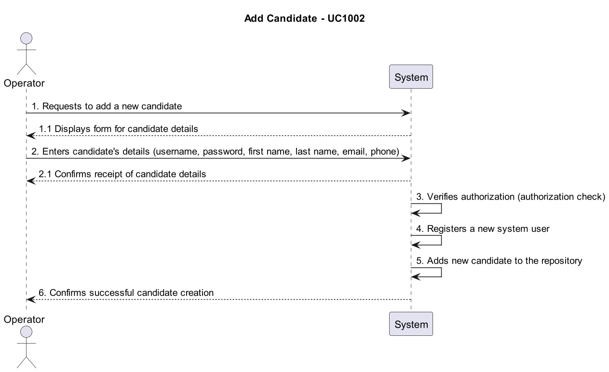
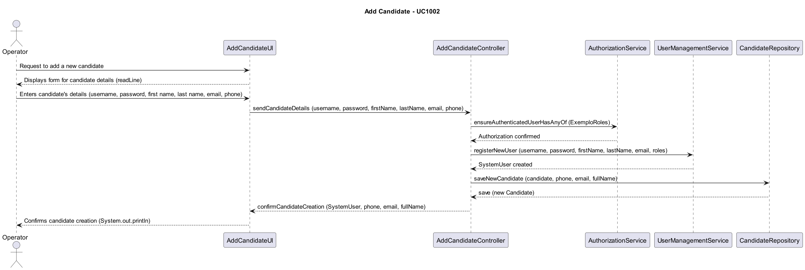

# US2000a -  As Operator, I want to register a candidate and create a corresponding user

## 1. Requirements Engineering

### 1.1. User Story Description

As Operator, I want to register a candidate and create a corresponding user

### 1.2. Customer Specifications and Clarifications

### 1.3. Acceptance Criteria

### 1.4. Found out Dependencies

### 1.5 Input and Output Data

- **Input**: Enters candidate's details (username, password, first name, last name, email, phone)

- **Output**: Confirms successful candidate creation

### 1.6. System Sequence Diagram (SSD)

## 2. OO Analysis

### 2.1. Relevant Domain Model Excerpt

### 2.2. Other Remarks

- None

## 3. Design - User Story Realization

### 3.1. Rationale

| Interaction ID | Question: Which class is responsible for...              | Answer                   | Justification (with patterns)                                                                               |
|----------------|-----------------------------------------------------|-------------------------|------------------------------------------------------------------------------------------------------------|
| Step 1          | Requests to add a new candidate                        | AddCandidateUI          | The UI receives the request from the Operator to add a new candidate.                                         |
| Step 2          | Displays form for candidate details                      | AddCandidateUI          | The UI displays the form for the Operator to enter candidate details.                                         |
| Step 3          | Enters candidate's details (username, password, etc.)       | Operator                | The Operator enters the candidate's information into the UI.                                                   |
| Step 4          | Sends candidate details to the controller                   | AddCandidateUI          | The UI sends the candidate's details to the Controller for processing.                                        |
| Step 5          | Checks if the user has required roles                         | AddCandidateController  | The Controller checks if the user has authorization with the AuthorizationService.                            |
| Step 6          | Authorization confirmed                                    | AuthorizationService   | The AuthorizationService confirms that the user has any of the required roles.                                |
| Step 7          | Registers a new system user                                | UserManagementService  | The UserManagementService registers a new system user based on the given details.                             |
| Step 8          | System user created successfully                           | UserManagementService  | The UserManagementService confirms successful creation of a new system user.                                   |
| Step 9          | Creates and saves a new candidate                           | AddCandidateController  | The Controller creates and saves a new candidate in the repository with the provided details.                |
| Step 10         | Candidate added to the repository                          | CandidateRepository     | The CandidateRepository confirms the successful addition of a new candidate.                                  |
| Step 11         | Confirms successful candidate creation                       | AddCandidateController  | The Controller informs the UI that the candidate was created successfully.                                      |
| Step 12         | UI confirms successful candidate creation                    | AddCandidateUI          | The UI notifies the Operator that the candidate was created successfully.                                       |

### 3.2. Sequence Diagram (SD)

### 3.3. Class Diagram (CD)

