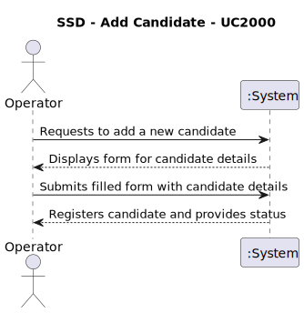
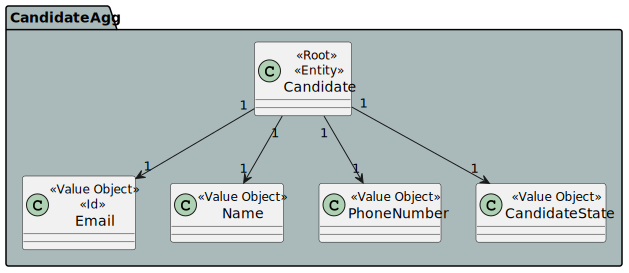
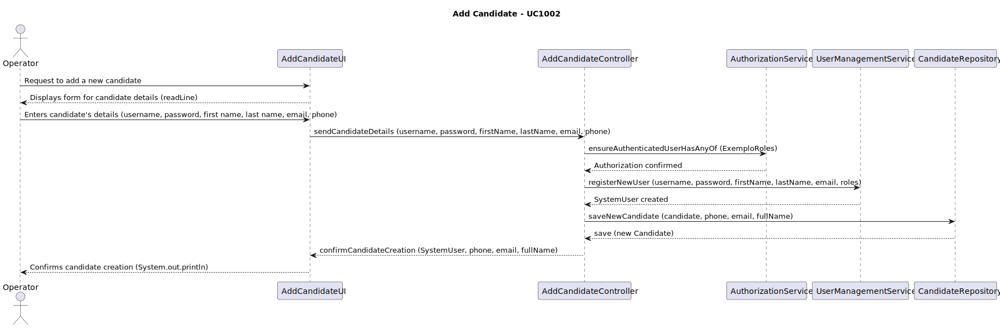
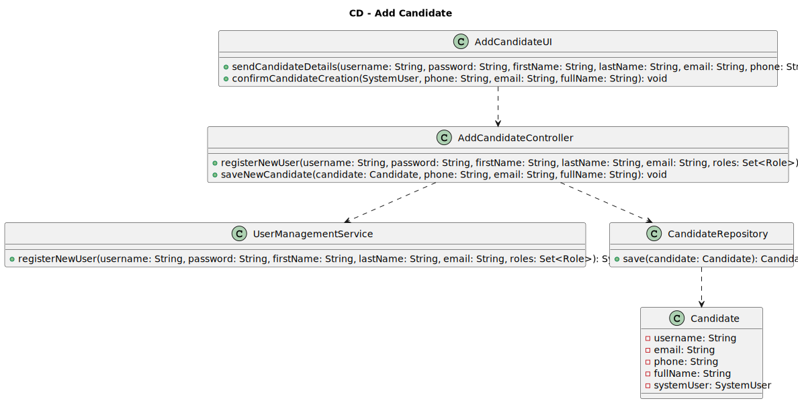

# US2000a -  As Operator, I want to register a candidate and create a corresponding user

## 1. Requirements Engineering

### 1.1. User Story Description

As Operator, I want to register a candidate and create a corresponding user

### 1.2. Customer Specifications and Clarifications

### 1.3. Acceptance Criteria

    - The system must allow the operator to input candidate details including username, password, first name, last name, email, and phone number.
    -  The system must validate that all input fields are filled out.
    - The system must check that the email format is correct.
    - The system should ensure that the username is unique within the system.
    - Upon successful validation, the system should create a new system user with the provided details.

### 1.4. Found out Dependencies

### 1.5 Input and Output Data

- **Input**: Enters candidate's details (username, password, first name, last name, email, phone)

- **Output**: Confirms successful candidate creation

### 1.6. System Sequence Diagram (SSD)

## 2. OO Analysis

### 2.1. Relevant Domain Model Excerpt

### 2.2. Other Remarks

- None

## 3. Design - User Story Realization

### 3.1. Rationale

| Interaction ID                                                 | Question: Which class is responsible for...            | Answer                       | Justification (with patterns)                                                                              |
|:---------------------------------------------------------------|:-------------------------------------------------------|:-----------------------------|:---------------------------------------------------------------------------------------------------------|
| **Step 1**: Operator requests to add a new candidate           | ... interacting with the actor?                        | `AddCandidateUI`             | **Pure Fabrication**: Manages user interaction and is not part of the domain model.                     |
|                                                                | ... coordinating the use case?                         | `AddCandidateController`     | **Controller**: Orchestrates the registration process based on user input.                               |
| **Step 2**: Operator provides candidate details                | ... handling user input validation and formatting?     | `AddCandidateUI`             | **Pure Fabrication**: Handles data input and ensures that it conforms to expected formats.              |
| **Step 3**: UI sends candidate details to the controller       | ... passing data to the next layer?                    | `AddCandidateUI`             | **Information Expert**: Has the information needed and is responsible for communicating it to the controller. |
| **Step 4**: Controller verifies authorization                  | ... ensuring that the user has permission to add a candidate? | `AuthorizationService`  | **Information Expert**: Manages security and authorization processes.                                    |
| **Step 5**: Controller creates a new system user               | ... creating a new system user?                        | `UserManagementService`      | **Creator**: Best suited to create new user instances as it encapsulates the logic for user creation.   |
| **Step 6**: Controller creates a new candidate                 | ... creating a new candidate?                          | `AddCandidateController`     | **Controller**: Directly handles the creation process, acting upon the data provided by the UI.         |
|                                                                | ... saving the new candidate?                          | `CandidateRepository`        | **Information Expert**: Responsible for managing candidate data persistence.                            |
| **Step 7**: Candidate added to the repository                  | ... persisting candidate data?                         | `CandidateRepository`        | **Information Expert**: Directly interacts with the data store to manage candidate entities.            |
| **Step 8**: Controller confirms successful candidate creation  | ... informing operation success?                       | `AddCandidateUI`             | **Pure Fabrication**: Responsible for showing success or failure messages to the Operator.              |
                                      |

### 3.2. Sequence Diagram (SD)

### 3.3. Class Diagram (CD)

