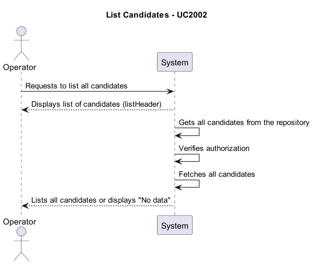
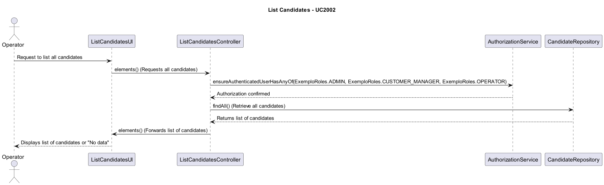

# US2000b -  As Operator, I want to list all candidates

## 1. Requirements Engineering

### 1.1. User Story Description

As Operator, I want to list all candidates

### 1.2. Customer Specifications and Clarifications

### 1.3. Acceptance Criteria

### 1.4. Found out Dependencies

As Operator, I want to register a candidate 

### 1.5 Input and Output Data

- **Output**: Lists all candidates

### 1.6. System Sequence Diagram (SSD)

## 2. OO Analysis

### 2.1. Relevant Domain Model Excerpt

### 2.2. Other Remarks

- None

## 3. Design - User Story Realization

### 3.1. Rationale

| Interaction ID | Question: Which class is responsible for...              | Answer                   | Justification (with patterns)                                                                               |
|----------------|-----------------------------------------------------|-------------------------|------------------------------------------------------------------------------------------------------------|
| Step 1          | Requests to list all candidates                         | ListCandidatesUI         | The UI receives the request from the Operator to list all candidates.                                       |
| Step 2          | Forwards the request to the controller                    | ListCandidatesUI         | The UI sends the request to the controller for processing.                                                  |
| Step 3          | Verifies authorization                                     | ListCandidatesController | The Controller checks if the user is authorized by calling AuthorizationService with required roles.      |
| Step 4          | Authorization confirmed                                    | AuthorizationService    | The AuthorizationService confirms that the user has the appropriate roles (ADMIN, CUSTOMER_MANAGER, OPERATOR). |
| Step 5          | Retrieves candidates from the repository                   | ListCandidatesController | The Controller sends a request to the CandidateRepository to retrieve all candidates.                      |
| Step 6          | Candidate data returned                                     | CandidateRepository     | The CandidateRepository returns a list of all candidates to the controller.                                 |
| Step 7          | Sends list of candidates to UI                              | ListCandidatesController | The Controller forwards the list of candidates to the UI for display.                                       |
| Step 8          | Displays list of candidates or "No data"                     | ListCandidatesUI         | The UI displays the list of candidates or a message if no data is available.                                 |

### 3.2. Sequence Diagram (SD)

### 3.3. Class Diagram (CD)

