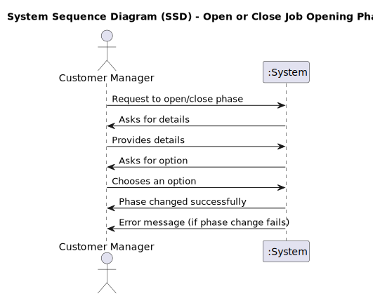
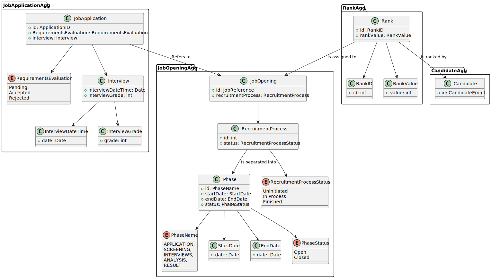
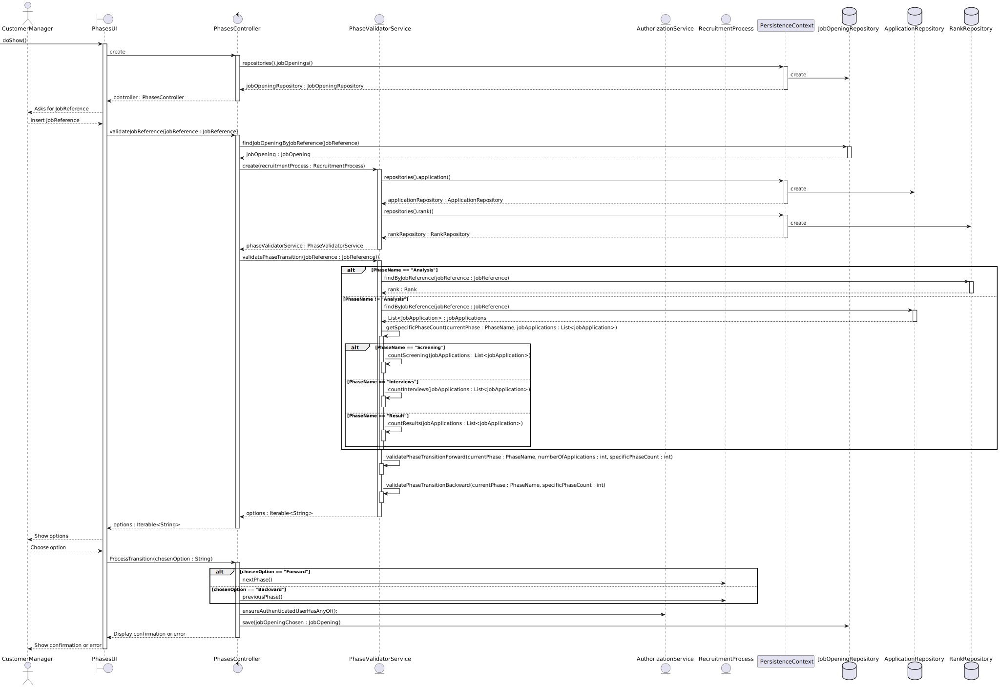
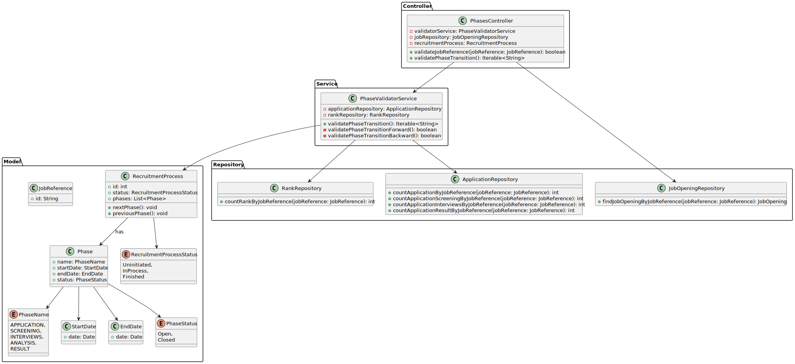

# US1010 - Open or Close Job Opening Phases

## 1. Requirements Engineering

### 1.1. User Story Description

As a Customer Manager, I want to open or close phases of the process for a job opening.

### 1.2. Customer Specifications and Clarifications

- **Customer Specification**:
    - The system must allow the Customer Manager to open or close specific phases of the recruitment process for a job opening.
    - Phases should follow the defined sequence without overlap; when one phase closes, the next one opens automatically.
    - The dates for each phase are indicative, and the Customer Manager should be able to activate a phase even if it is not within the predefined date range.
    - The phases must follow a strict sequence, and it is not possible to proceed to the next phase without closing the current phase, even if the dates for the current phase have not been met. The phases in the recruitment process are strictly sequential and must follow the defined order without overlaps.

- **Clarifications**:
    - Opening or closing a phase means changing its status to active or inactive.
    - The phases are sequential: Application, Screening, Interviews (optional), Analysis, Result.
    - The Customer Manager is responsible for managing all phases of the process. Responsibilities include setting phase dates, managing transitions, and updating phase status in the system.
    - The interview phase is optional and its inclusion is determined by the Customer Manager during the setup of the recruitment process.

### Recruitment Process Phases

| Phase        | Description                                                                                                      |
|--------------|------------------------------------------------------------------------------------------------------------------|
| Application  | Candidates submit their applications.                                                                            |
| Screening    | Applications are verified against a set of requirements. Applications not meeting the requirements are rejected. |
| Interviews   | (Optional) Accepted candidates may be interviewed. Results are recorded for further analysis.                    |
| Analysis     | Applications are analyzed using all available information. Candidates are ranked based on this analysis.         |
| Result       | Candidates and customers are notified of the final results.                                                      |

### 1.3. Acceptance Criteria

- **Criteria**:
    - The Customer Manager can successfully change the status of a phase to open or close.
    - The system should automatically transition to the next phase when the current phase is closed.
    - The phases must be managed within the recruitment process defined for each job opening.

### 1.4. Identified Dependencies

- **Dependencies**:
    - The job opening and its recruitment process must be registered in the system.
    - The phase transition logic must be implemented in accordance with the defined recruitment process.
    - The system should allow the Customer Manager to skip the interview phase if it is not included in the recruitment process for a specific job opening.
    - Support registration and verification of applications for phase validation.
    - Support ranking of candidates during the Analysis phase.
    - Support notification to inform candidates and customers of the final results.
    - Ensure database support for persisting changes and retrieving job opening and phase data.
    - Ensure user authentication and authorization to allow only the Customer Manager to manage phase transitions.

### 1.5 Input and Output Data

- **Input Data**:
    - Job Reference
    - Desired action (open or close a specific phase, move to the next phase, or return to the previous phase)

- **Output Data**:
    - Confirmation of the phase status change
    - Updated recruitment process status
    - Validation messages if the requested action is not allowed (e.g., trying to skip a phase without completing the current phase)

### 1.6. System Sequence Diagram (SSD)

**Description**:
- The SSD shows the interaction between the Customer Manager and the system when opening or closing a phase.
- The sequence should start with the Customer Manager's request and end with the system's confirmation or error of the phase status change.

### 1.7 Other Relevant Remarks

- **Remarks**:
    - Ensure that phase transitions do not disrupt any ongoing candidate applications activity.

## 2. OO Analysis

### 2.1. Relevant Domain Model Excerpt

#### Description
- The domain model illustrates the `JobOpening` aggregate and its relationship with phases of the recruitment process, job applications, and ranks.
- Each `JobOpening` can have multiple phases, and these phases must follow a strict sequential order as defined in the recruitment process.
- The `JobOpening` aggregate includes a `RecruitmentProcess`, which tracks the status of the overall process. The status can be uninitiated, in process, or finished, reflecting the overall progression of the job opening phases.
- Each `Phase` within the `RecruitmentProcess` is defined by its name, start date, end date, and status (open or closed).
- `JobApplications` are associated with `JobOpening` and include evaluations based on requirements and interviews. The model captures details of the interview process, including interview dates and grades, and indicates whether applications are accepted or rejected.
- Additionally, the model includes a `Rank` aggregate. Each `Rank` is associated with a `JobOpening` and has a unique identifier and value. Ranks are assigned to job openings and are evaluated by candidates.
- The `Rank` aggregate captures the ranking of candidates, which is crucial for phases that involve ranking assessments.

**Domain Model Changes**:
- The implementation of `RecruitmentProcessStatus` is necessary to accurately reflect the state of the recruitment process when all phases are `Closed`.
- This status is critical to distinguish between a recruitment process that hasn't been initialized and one that has finished. Without this differentiation, a closed phase could ambiguously indicate either an uninitiated or a concluded recruitment process.
- The inclusion of `RecruitmentProcessStatus` ensures clarity in the overall state of the recruitment process, providing a precise understanding of whether the recruitment is yet to start or has been completed.

### 2.2. Other Remarks

- **Remarks**:
    - Ensure that phase objects within a `JobOpening` are manipulated correctly to reflect their status transitions.
    - Any changes to the phases should be immediately reflected in the system's state and visible to relevant actors (Customer Manager and potentially Admin).
    - Ensure that the phase transitions are managed without overlaps. Each phase must be closed before the next one can be opened.

## 3. Design - User Story Realization

### 3.1. Rationale

**The rationale grounds on the SSD interactions and the identified input/output data.**

| Interaction ID | Question: Which class is responsible for... | Answer                  | Justification (with patterns)                                                                  |
|:---------------|:--------------------------------------------|:------------------------|:-----------------------------------------------------------------------------------------------|
| Step 1         | User inserts JobReference as asked          | `PhasesUI`              | The UI component collects the job reference input from the user.                               |
| Step 2         | Submitting JobReference for validation      | `PhasesController`      | The controller coordinates the job reference validation request to the `JobOpeningRepository`. |
| Step 3         | Validating if JobReference exists           | `JobOpeningRepository`  | Validates if the provided job reference corresponds to an existing job opening.                |
| Step 4         | JobReference validation result              | `PhasesController`      | Receives the validation result from the `JobOpeningRepository`.                                |
| Step 5         | Checking phase transition validity          | `PhaseValidatorService` | Validates if the current phase of the job opening can go forward, backward, both, or neither.  |
| Step 6         | User selects the desired action             | `PhasesUI`              | The UI component allows the user to select the desired phase transition action.                |
| Step 7         | Updating the phase status                   | `PhasesController`      | The controller coordinates the update request to the `RecruitmentProcess` domain model.        |
| Step 8         | Changing phase status                       | `RecruitmentProcess`    | The domain model updates the status of the phases as per the user's request.                   |
| Step 9         | Saving the changes                          | `JobOpeningRepository`  | Persists the changes in the database.                                                          |
| Step 10        | Displaying confirmation or error message    | `PhasesUI`              | Prints confirmation or error message in the UI.                                                |

#### Phase Validation Logic

The `PhaseValidatorService` validates the phase transition options for each phase as follows:

- **Application Phase**:
    - Can move forward if there is at least one application.
    - Cannot move backward since it is the first phase. `Question Asked to PO : Can move backward if no applications have been submitted?` 
    - **Dependencies**: Interacts with `ApplicationRepository` to count applications.
  
- **Screening Phase**:
    - Can move backward if no applications have been verified.
    - Can move forward if all applications have been verified.
    - **Dependencies**: Interacts with `ApplicationRepository` to check if applications are verified against requirements.

- **Interviews Phase** (if included):
    - Can move backward if no interviews have been conducted.
    - Can move forward if all scheduled interviews are completed.
    - **Dependencies**: Interacts with `ApplicationRepository` to check interview statuses.

- **Analysis Phase**:
    - Can move backward if the candidates have not been ranked.
    - Can move forward if candidates have been ranked.
    - **Dependencies**: Interacts with `RankRepository` to check if candidates have been ranked.

- **Result Phase**:
    - Can move backward if no results have been published.
    - Can close the phase if results have been published.
    - **Dependencies**: Checks if results have been published within the `ApplicationRepository`.

#### Systematization

According to the taken rationale, the conceptual classes promoted to software classes are:

- `PhasesController`: Handles the initial request for opening or closing a phase and coordinates the process.
- `PhaseValidatorService`: Validates the phase transition to ensure it complies with business rules (e.g., no overlaps, proper sequence).
- `RecruitmentProcess`: The domain model class that represents the job opening and its phases, responsible for updating phase statuses.
- `JobOpeningRepository`: Validates the job reference and persists the changes to the job opening in the database.
- `PhasesUI`: The user interface component that allows the Customer Manager to interact with the job opening phases.

Other software classes (i.e., Pure Fabrication) identified:

- `PhasesUI`: The user interface component that allows the Customer Manager to interact with the job opening phases.
- `PhasesController`: Coordinates the interaction between the UI, domain model, and other services.

## 3.2. Sequence Diagram (SD)

#### Interaction Steps

1. **Insert Job Reference**:
  - The `CustomerManager` inputs a job reference into the `PhasesUI`.

2. **Submit Job Reference**:
  - The `PhasesUI` submits the job reference to the `PhasesController`.

3. **Validate Job Reference**:
  - The `PhasesController` sends a request to the `JobOpeningRepository` to validate the job reference.
  - The `JobOpeningRepository` returns the validation result to the `PhasesController`.

4. **Validate Phase Transition**:
  - The `PhasesController` requests the `PhaseValidatorService` to validate the phase transition.

5. **Conditional Check**:
  - Depending on the phase type, the `PhaseValidatorService` performs one of two checks:
    - If the phase involves application checks:
      - The `PhaseValidatorService` queries the `ApplicationRepository` for the application status.
      - The `ApplicationRepository` returns the application status to the `PhaseValidatorService`.
    - If the phase involves rank checks:
      - The `PhaseValidatorService` queries the `RankRepository` for the rank status.
      - The `RankRepository` returns the rank status to the `PhaseValidatorService`.

6. **Return Validation Result**:
  - The `PhaseValidatorService` sends the validation result back to the `PhasesController`.

7. **Display Transition Options**:
  - The `PhasesController` displays the transition options to the `PhasesUI`.

8. **Select Action**:
  - The `CustomerManager` selects an action on the `PhasesUI`.

9. **Submit Action**:
  - The `PhasesUI` submits the selected action to the `PhasesController`.

10. **Update Phase Status**:
  - The `PhasesController` updates the phase or phases status in the `RecruitmentProcess`.
  - The `RecruitmentProcess` saves the changes to the `JobOpeningRepository`.
  - The `JobOpeningRepository` confirms the changes saved back to the `RecruitmentProcess`.
  - The `RecruitmentProcess` sends the updated status to the `PhasesController`.

11. **Display Confirmation or Error**:
  - The `PhasesController` sends a confirmation or error message to the `PhasesUI`.
  - The `PhasesUI` shows the confirmation or error message to the `CustomerManager`.

## 3.3. Class Diagram (CD)

### Description

- `PhasesController`: Intermediary between UI and service layer, handling job reference validation and phase transitions.
- `PhaseValidatorService`: Validates phase transitions according to business rules.
- `JobOpeningRepository`: Handles persistence and retrieval of job opening data.
- `ApplicationRepository`: Counts applications in various states for a job reference.
- `RankRepository`: Counts ranks associated with a job reference.
- `JobReference`: Unique identifier for a job opening.
- `RecruitmentProcess`: Represents the recruitment process with phases and status.
- `Phase`: Represents an individual phase within the recruitment process.
- `PhaseName`: Enum for phase names (APPLICATION, SCREENING, INTERVIEWS, ANALYSIS, RESULT).
- `StartDate`: Start date of a phase.
- `EndDate`: End date of a phase.
- `PhaseStatus`: Enum for phase status (Open, Closed).
- `RecruitmentProcessStatus`: Enum for recruitment process status (Uninitiated, InProcess, Finished).

#### Relationships
- `PhasesController` validates job references and phase transitions using `PhaseValidatorService` and `JobOpeningRepository`.
- `PhaseValidatorService` uses `ApplicationRepository` and `RankRepository` for data validation.
- `RecruitmentProcess` contains multiple `Phase` objects.
- `Phase` associates with `PhaseName`, `StartDate`, `EndDate`, and `PhaseStatus`.
- `RecruitmentProcess` tracks its state with `RecruitmentProcessStatus`.

# 4. Tests

## Unit Tests

### 1. `PhaseValidatorService` Tests
#### Test: Validate Forward Transition from Application Phase
**Description:** Verify that the transition from the Application phase to the Screening phase is valid if there is at least one application.

	@Test(expected = IllegalArgumentException.class)
		public void ensureNullIsNotAllowed() {
		Exemplo instance = new Exemplo(null, null);
	}

#### Test: Validate Backward Transition from Screening Phase
**Description:** Ensure that moving back from the Screening phase to the Application phase is valid if no applications have been verified.

	@Test(expected = IllegalArgumentException.class)
		public void ensureNullIsNotAllowed() {
		Exemplo instance = new Exemplo(null, null);
	}

#### Test: Validate Transition When No Applications
**Description:** Confirm that transitioning forward from the Application phase is invalid if there are no applications.

	@Test(expected = IllegalArgumentException.class)
		public void ensureNullIsNotAllowed() {
		Exemplo instance = new Exemplo(null, null);
	}

### 2. `RecruitmentProcess` Tests
#### Test: Next Phase Transition
**Description:** Verify that calling `nextPhase()` correctly advances the process from the current phase to the next phase in the sequence.

	@Test(expected = IllegalArgumentException.class)
		public void ensureNullIsNotAllowed() {
		Exemplo instance = new Exemplo(null, null);
	}

#### Test: Previous Phase Transition
**Description:** Ensure that calling `previousPhase()` correctly moves the process back from the current phase to the previous phase.

	@Test(expected = IllegalArgumentException.class)
		public void ensureNullIsNotAllowed() {
		Exemplo instance = new Exemplo(null, null);
	}

#### Test: Validate Phase Status Change
**Description:** Check that the status of a phase changes correctly from Open to Closed and vice versa.

	@Test(expected = IllegalArgumentException.class)
		public void ensureNullIsNotAllowed() {
		Exemplo instance = new Exemplo(null, null);
	}

### 3. `PhasesController` Tests
#### Test: Validate Job Reference
**Description:** Verify that the job reference provided by the Customer Manager is correctly validated.

    @Test(expected = IllegalArgumentException.class)
    public void ensureNullIsNotAllowed() {
    Exemplo instance = new Exemplo(null, null);
    }
#### Test: Handle Valid Phase Transition Request
**Description:** Ensure that the controller handles a valid phase transition request appropriately and updates the phase status.

	@Test(expected = IllegalArgumentException.class)
		public void ensureNullIsNotAllowed() {
		Exemplo instance = new Exemplo(null, null);
	}

# 5. Construction (Implementation)

_In this section, it is suggested to provide, if necessary, some evidence that the construction/implementation is in accordance with the previously carried out design. Furthermore, it is recommeded to mention/describe the existence of other relevant (e.g. configuration) files and highlight relevant commits._

_It is also recommended to organize this content by subsections._

# 6. Integration and Demo

_In this section, it is suggested to describe the efforts made to integrate this functionality with the other features of the system._

# 7. Observations

_In this section, it is suggested to present a critical perspective on the developed work, pointing, for example, to other alternatives and or future related work._