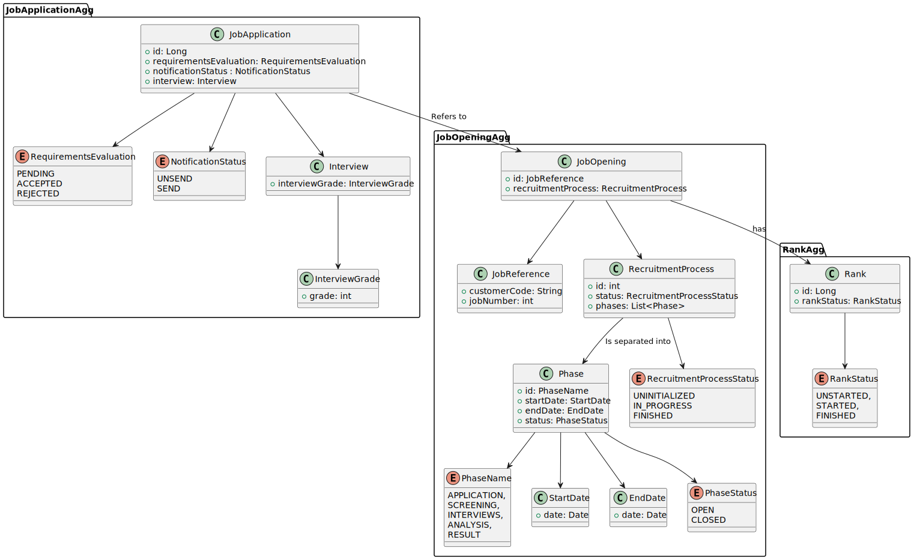
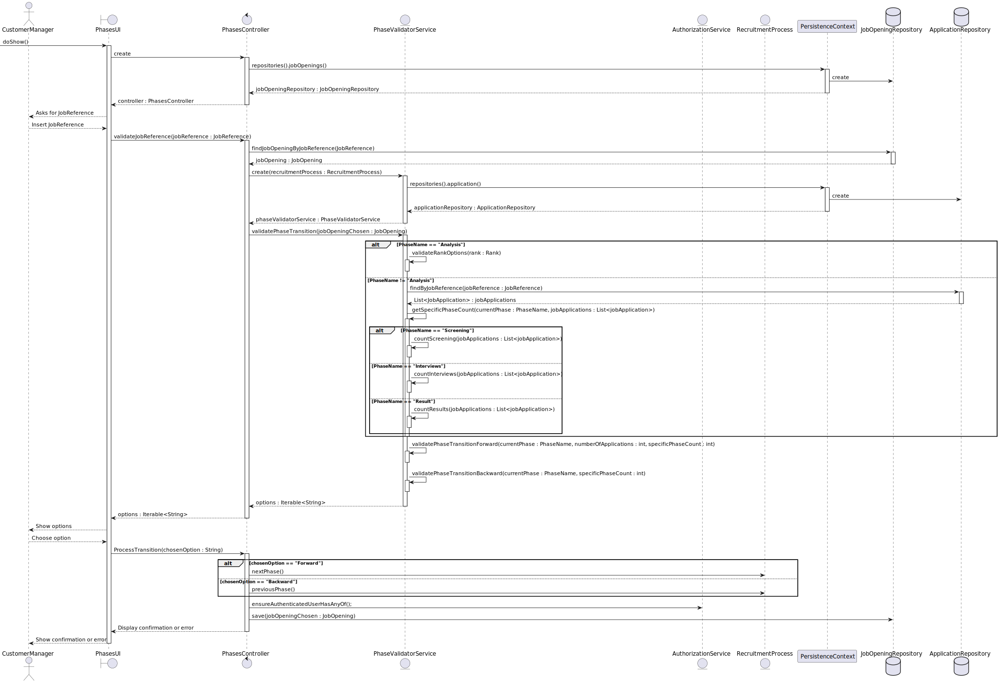

# US1010 - Open or Close Job Opening Phases

## 1. Requirements Engineering

### 1.1. User Story Description

As a Customer Manager, I want to open or close phases of the process for a job opening.

### 1.2. Customer Specifications and Clarifications

- **Customer Specification**:
    - The system must allow the Customer Manager to open or close specific phases of the recruitment process for a job opening.
    - Phases should follow the defined sequence without overlap; when one phase closes, the next one opens automatically.
    - The dates for each phase are indicative, and the Customer Manager should be able to activate a phase even if it is not within the predefined date range.
    - The phases must follow a strict sequence, and it is not possible to proceed to the next phase without closing the current phase, even if the dates for the current phase have not been met.

- **Clarifications**:
    - Opening or closing a phase means changing its status to active or inactive.
    - The phases are sequential: Application, Screening, Interviews (optional), Analysis, Result.
    - The Customer Manager has the responsibility to manage the phases, including setting their dates and determining if interviews are included
  
### Recruitment Process Phases

| Phase        | Description                                                                                                      |
|--------------|------------------------------------------------------------------------------------------------------------------|
| Application  | Candidates submit their applications.                                                                            |
| Screening    | Applications are verified against a set of requirements. Applications not meeting the requirements are rejected. |
| Interviews   | (Optional) Accepted candidates may be interviewed. Results are recorded for further analysis.                    |
| Analysis     | Applications are analyzed using all available information. Candidates are ranked based on this analysis.         |
| Result       | Candidates and customers are notified of the final results.                                                      |

### 1.3. Acceptance Criteria

- **Criteria**:
    - The Customer Manager can successfully change the status of a phase to open or close.
    - The system should automatically transition to the next phase when the current phase is closed.
    - The phases must be managed within the recruitment process defined for each job opening.

### 1.4. Identified Dependencies

- **Dependencies**:
    - The job opening and its recruitment process must be registered in the system.
    - The phase transition logic must be implemented in accordance with the defined recruitment process.
    - The system should allow the Customer Manager to skip the interview phase if it is not included in the recruitment process for a specific job opening.

### 1.5 Input and Output Data

- **Input Data**:
    - Job Reference
    - Desired action (open or close a specific phase, move to the next phase, or return to the previous phase)

- **Output Data**:
    - Confirmation of the phase status change
    - Updated recruitment process status
    - Validation messages if the requested action is not allowed (e.g., trying to skip a phase without completing the current phase)

### 1.6. System Sequence Diagram (SSD)

**Description**:
- The SSD shows the interaction between the Customer Manager and the system when opening or closing a phase.
- The sequence should start with the Customer Manager's request and end with the system's confirmation or error of the phase status change.

### 1.7 Other Relevant Remarks

- **Remarks**:
    - Ensure that phase transitions do not disrupt any ongoing candidate evaluations.

## 2. OO Analysis

### 2.1. Relevant Domain Model Excerpt

**Description**:
- The domain model illustrates the `JobOpening` aggregate and its relationship with phases of the recruitment process.
- Each `JobOpening` can have multiple phases, but the phases must follow a strict sequence as defined in the recruitment process.

### 2.2. Other Remarks

- **Remarks**:
    - Ensure that phase objects within a `JobOpening` are manipulated correctly to reflect their status transitions.
    - Any changes to the phases should be immediately reflected in the system's state and visible to relevant actors (Customer Manager and potentially Admin).
    - Ensure that the phase transitions are managed without overlaps. Each phase must be closed before the next one can be opened.
    - The recruitment process phases are fixed, but the interview phase is optional and determined by the Customer Manager at the beginning of the process.

## 3. Design - User Story Realization

### 3.1. Rationale

**The rationale grounds on the SSD interactions and the identified input/output data.**

| Interaction ID | Question: Which class is responsible for... | Answer                  | Justification (with patterns)                                                                      |
|:---------------|:--------------------------------------------|:------------------------|:---------------------------------------------------------------------------------------------------|
| Step 1         | User inserts JobReference as asked          | `PhasesUI`              | The UI component collects the job reference input from the user.                                   |
| Step 2         | Validating if phase can move                | `PhasesController`      | The controller coordinates the validation request to the `PhaseValidatorService`.                  |
| Step 3         | Checking phase transition validity          | `PhaseValidatorService` | Validates if the current phase of the job opening can go forward, backward, both, or neither.      |
| Step 4         | User selects the desired action             | `PhasesUI`              | The UI component allows the user to select the desired phase transition action.                    |
| Step 5         | Updating the phase status                   | `PhasesController`      | The controller coordinates the update request to the `RecruitmentProcess` domain model.            |
| Step 6         | Changing phase status                       | `RecruitmentProcess`    | The domain model updates the status of the phases as per the user's request.                       |
| Step 7         | Saving the changes                          | `JobOpeningRepository`  | Persists the changes in the database.                                                              |
| Step 8         | Displaying confirmation or error message    | `PhasesUI`              | Prints confirmation or error message in the UI.                                                    |

### Systematization

According to the taken rationale, the conceptual classes promoted to software classes are:

- `PhasesController`: Handles the initial request for opening or closing a phase and coordinates the process.
- `PhaseValidatorService`: Validates the phase transition to ensure it complies with business rules (e.g., no overlaps, proper sequence).
- `RecruitmentProcess`: The domain model class that represents the job opening and its phases, responsible for updating phase statuses.
- `JobOpeningRepository`: Persists the changes to the job opening in the database.
- `PhasesUI`: The user interface component that allows the Customer Manager to interact with the job opening phases.

Other software classes (i.e., Pure Fabrication) identified:

- `PhasesUI`: The user interface component that allows the Customer Manager to interact with the job opening phases.
- `PhasesController`: Coordinates the interaction between the UI, domain model, and other services.

### Interaction Steps:

1. `PhasesUI` prompts the user to insert the JobReference.
2. `PhasesController` receives the JobReference and calls `PhaseValidatorService` to check if the current phase of the specified `JobOpening` can move forward, backward, both, or neither.
3. `PhaseValidatorService` validates the phase transition options.
4. Based on the validation result, `PhasesUI` allows the user to select the desired phase transition action (if applicable).
5. `PhasesController` receives the user's selection and coordinates the update request to the `RecruitmentProcess` domain model.
6. `RecruitmentProcess` changes the phase status according to the user's selection.
7. `PhasesController` calls `JobOpeningRepository` to save the changes to the database.
8. `PhasesUI` displays a confirmation message if the process went well or an error message if an error occurs.

## 3.2. Sequence Diagram (SD)

_In this section, it is suggested to present an UML dynamic view representing the sequence of interactions between software objects that allows to fulfill the requirements._

## 3.3. Class Diagram (CD)

_In this section, it is suggested to present an UML static view representing the main related software classes that are involved in fulfilling the requirements as well as their relations, attributes and methods._

# 4. Tests
_In this section, it is suggested to systematize how the tests were designed to allow a correct measurement of requirements fulfilling._

**_DO NOT COPY ALL DEVELOPED TESTS HERE_**

**Test 1:** Check that it is not possible to create an instance of the Example class with null values.

	@Test(expected = IllegalArgumentException.class)
		public void ensureNullIsNotAllowed() {
		Exemplo instance = new Exemplo(null, null);
	}

_It is also recommended to organize this content by subsections._

# 5. Construction (Implementation)

_In this section, it is suggested to provide, if necessary, some evidence that the construction/implementation is in accordance with the previously carried out design. Furthermore, it is recommeded to mention/describe the existence of other relevant (e.g. configuration) files and highlight relevant commits._

_It is also recommended to organize this content by subsections._

# 6. Integration and Demo

_In this section, it is suggested to describe the efforts made to integrate this functionality with the other features of the system._

# 7. Observations

_In this section, it is suggested to present a critical perspective on the developed work, pointing, for example, to other alternatives and or future related work._