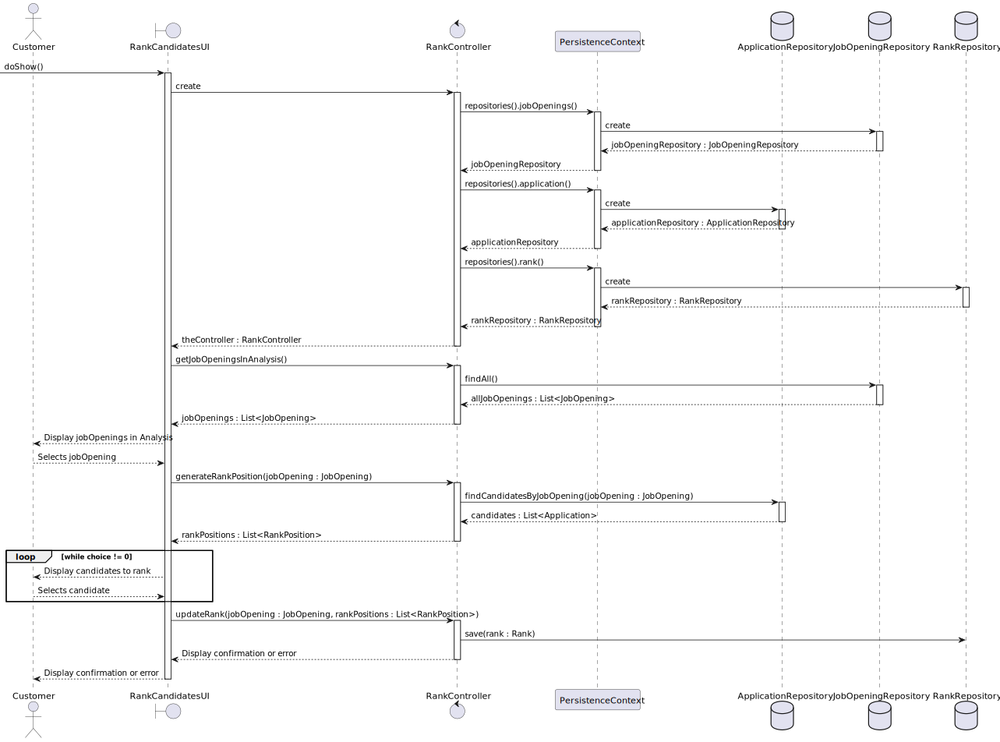
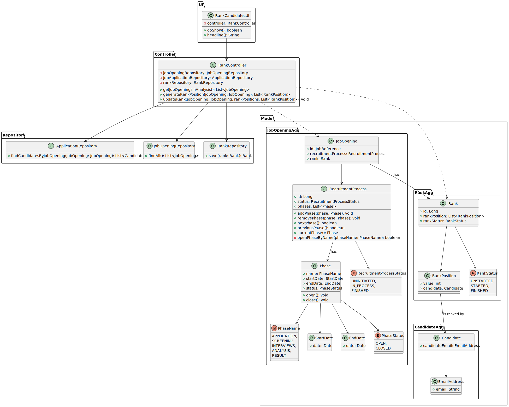

# US1013 - Rank the Candidates for a Job Opening

## 1. Requirements Engineering

### 1.1. User Story Description

As a Customer Manager, I want to rank the candidates for a job opening.

### 1.2. Customer Specifications and Clarifications

- **Customer Specification**:
  - The system must allow the Customer Manager to rank candidates for a job opening.
  - The fact that there are no interviews has no bearing on the ranking of candidates, as this does not explicitly depend on interviews. (Job Opening could not have interviews as a requirement).
  - The ranking should be recorded and stored for each candidate.
  - After ranking all candidates, the information should be available for the next phase (Results).

- **Clarifications**:
  - Ranking candidates involves assigning a position in a ranked list based on several criteria.
  - The Customer Manager is responsible for analyzing applications and deciding the ranking of candidates.
  - The Customer Manager performs the ranking during the analysis phase using all available information, including CVs and interview results if applicable.
  - The ranking process should allow the Customer Manager to stop and continue later if needed.
  - The Customer Manager can change the rank of a candidate if none of the interested parties were yet notified of the results.

### Recruitment Process Phases

| Phase        | Description                                                                                                      |
|--------------|------------------------------------------------------------------------------------------------------------------|
| Analysis     | Applications are analyzed using all available information. Candidates are ranked based on this analysis.         |

### 1.3. Acceptance Criteria

- **Criteria**:
  - All candidates must be ranked before moving to the next phase (it just runs in another US).
  - Ranking is not automatic and requires the Customer Manager to manually assign positions to candidates.

### 1.4. Identified Dependencies

- **Dependencies**:
  - Register an application of a candidate for a job opening
  - Ensure user authentication and authorization to allow only the Customer Manager to rank candidates.
  - Candidates must have completed the previous phases before they can be ranked.
  - Execute the process of verification of requirements of applications for a job opening.

### 1.5 Input and Output Data

- **Input Data**:
  - Option to select a job opening
  - Ranks the candidate

- **Output Data**:
  - List of job openings
  - List of candidates
  - Confirmation or error message

### 1.6. System Sequence Diagram (SSD)

**Description**:
- The SSD shows the sequence of interactions between the Customer Manager and the system to rank the candidates for a job opening.
- The Customer Manager selects a job opening and ranks the candidates.

### 1.7 Other Relevant Remarks

- *Remarks*:
  - N/A
## 2. OO Analysis

### 2.1. Relevant Domain Model Excerpt

#### Description
- The domain model illustrates the `JobOpening` aggregate and its relationship with phases of the recruitment process, ranks, and candidates.
- Each `JobOpening` can have multiple phases, and these phases must follow a strict sequential order as defined in the recruitment process.
- The `JobOpening` aggregate includes a `RecruitmentProcess`, which tracks the status of the overall process. The status can be uninitiated, in process, or finished, reflecting the overall progression of the job opening phases.
- Each `Phase` within the `RecruitmentProcess` is defined by its name, start date, end date, and status (open or closed).
- The model includes a `Rank` aggregate. Each `Rank` is associated with a `JobOpening` and has a unique identifier, rank position and rank status. Ranks are assigned to job openings and are evaluated by candidates.
- Additionally, the model includes a `Candidate` aggregate. Each `Candidate` is associated with an email address, and candidates are ranked through the RankPosition.
- The `RankPosition` class represents the ranking position assigned to a candidate.
- The model includes a `Candidate` aggregate. Each `Candidate` is associated with an email address, and candidates are ranked through the `RankPosition`.

**Domain Model Changes**:
- The `Rank` aggregate now includes `rankStatus` to reflect the state of the ranking process (unstarted, started, finished).
- `RankPosition` directly links a candidate to their respective rank value.
- This change ensures that each candidate’s ranking status and position are clearly represented and managed within the system.
### 2.2. Other Remarks

- **Remarks**:
  - Ensure that phase objects within a `JobOpening` are manipulated correctly to reflect their status transitions.
  - Any changes to the phases should be immediately reflected in the system's state and visible to relevant actors (Customer Manager and potentially Admin).
  - Ensure that the phase transitions are managed without overlaps. Each phase must be closed before the next one can be opened.
  - Ensure that `RankPosition` correctly links to `Candidate` and reflects accurate ranking.

## 3. Design - User Story Realization

### 3.1. Rationale

**The rationale grounds on the SSD interactions and the identified input/output data.**

| Interaction ID | Question: Which class is responsible for... | Answer                | Justification (with patterns)                                                                           |
|:---------------|:--------------------------------------------|:----------------------|:--------------------------------------------------------------------------------------------------------|
| Step 1         | User initiates the ranking process          | RankCandidatesUI      | *Pure Fabrication*: The UI component initiates the ranking process.                                     |
| Step 2         | Creating an instance of RankController      | RankCandidatesUI      | *Creator*: The UI component creates an instance of the RankController.                                  |
| Step 3         | Requesting JobOpeningController             | JobOpeningController  | *Controller*: The controller requests the JobOpeningRepository from the PersistenceContext.             |
| Step 4         | Requesting JobOpeningRepository             | PersistenceContext    | *Factory*: The PersistenceContext creates the JobOpeningRepository.                                     |
| Step 5         | Requesting ApplicationController            | ApplicationController | *Controller*: The controller requests the ApplicationRepository from the PersistenceContext.            |
| Step 6         | Requesting ApplicationRepository            | PersistenceContext    | *Factory*: The PersistenceContext creates the ApplicationRepository.                                    |
| Step 7         | Requesting RankController                   | RankController        | *Controller*: The controller requests the RankRepository from the PersistenceContext.                   |
| Step 8         | Requesting RankRepository                   | PersistenceContext    | *Factory*: The PersistenceContext creates the RankRepository.                                           |
| Step 9         | Displaying job openings in analysis         | RankCandidatesUI      | *Pure Fabrication*: The UI component displays the job openings in analysis to the user.                 |
| Step 10        | Generating rank positions for job opening   | RankController        | *Controller*: The controller coordinates the generation of rank positions for the selected job opening. |
| Step 11        | Finding candidates for job opening          | ApplicationRepository | *Information Expert*: The ApplicationRepository has the information needed to find candidates.          |
| Step 12        | Displaying candidates to rank               | RankCandidatesUI      | *Pure Fabrication*: The UI component displays the candidates to the user for ranking.                   |
| Step 13        | Updating the rank for job opening           | RankController        | *Controller*: The controller coordinates the update of the rank for the job opening.                    |
| Step 14        | Saving the updated rank                     | RankRepository        | *Information Expert*: The RankRepository has the information needed to save the updated rank.           |
| Step 15        | Displaying confirmation or error message    | RankCandidatesUI      | *Pure Fabrication*: The UI component displays the confirmation or error message to the user.            |

## 3.2. Sequence Diagram (SD)

### Description

- **Customer**: Interacts with the `RankCandidatesUI` to view job openings and rank candidates.
- **RankCandidatesUI**: User interface that interacts with the `RankController` to manage candidate ranking for job openings.
- **RankController**: Coordinates interactions between the `RankCandidatesUI` and various repositories. Retrieves job openings and candidates, and updates the ranking of candidates.
- **PersistenceContext**: Manages access to repositories.
- **ApplicationRepository**: Manages the storage and retrieval of job application data.
- **JobOpeningRepository**: Manages the storage and retrieval of job opening data.
- **RankRepository**: Manages the storage and retrieval of rank data.

### Sequence of Interactions

1. **Customer** initiates the process by interacting with `RankCandidatesUI` via `doShow()`.
2. **RankCandidatesUI** creates an instance of `RankController`.
3. **RankController** requests `JobOpeningRepository` from `PersistenceContext`.
4. **PersistenceContext** provides `JobOpeningRepository` to `RankController`.
5. **RankController** requests `ApplicationRepository` from `PersistenceContext`.
6. **PersistenceContext** provides `ApplicationRepository` to `RankController`.
7. **RankController** requests `RankRepository` from `PersistenceContext`.
8. **PersistenceContext** provides `RankRepository` to `RankController`.
9. **RankController** returns the controller instance to `RankCandidatesUI`.
10. **RankCandidatesUI** requests job openings in the analysis phase from `RankController` via `getJobOpeningsInAnalysis()`.
11. **RankController** queries `JobOpeningRepository` to retrieve all job openings.
12. **JobOpeningRepository** returns a list of all job openings to `RankController`.
13. **RankController** returns the list of job openings to `RankCandidatesUI`.
14. **RankCandidatesUI** displays the job openings in the analysis phase to **Customer**.
15. **Customer** selects a job opening and informs `RankCandidatesUI`.
16. **RankCandidatesUI** requests `RankController` to generate rank positions for the selected job opening.
17. **RankController** queries `ApplicationRepository` to find candidates for the selected job opening.
18. **ApplicationRepository** returns a list of candidates to `RankController`.
19. **RankController** returns the rank positions to `RankCandidatesUI`.
20. **RankCandidatesUI** displays the candidates to **Customer** for ranking.
21. **Customer** selects a candidate, and this interaction continues in a loop until the ranking is complete.
22. **RankCandidatesUI** requests `RankController` to update the rank for the job opening with the provided rank positions.
23. **RankController** saves the updated rank using `RankRepository`.
24. **RankController** returns a confirmation or error message to `RankCandidatesUI`.
25. **RankCandidatesUI** displays the confirmation or error message to **Customer**.

## 3.3. Class Diagram (CD)

### Description

- `RankController`: Manages the ranking process by interacting with various repositories and orchestrating the generation and updating of rank positions.
- `RankCandidatesUI`: User interface for displaying job openings in analysis and interacting with the rank generation process.
- `ApplicationRepository`: Repository for managing job applications.
- `JobOpeningRepository`: Repository for managing job openings.
- `RankRepository`: Repository for managing rank data.
- `JobOpening`: Represents a job opening with its associated recruitment process and rank.
- `RecruitmentProcess`: Represents the recruitment process with phases and status.
- `Phase`: Represents an individual phase within the recruitment process.
- `PhaseName`: Enum representing the names of phases in the recruitment process.
- `StartDate`: Represents the start date of a phase.
- `EndDate`: Represents the end date of a phase.
- `PhaseStatus`: Enum representing the status of a phase.
- `RecruitmentProcessStatus**: Enum representing the status of the recruitment process.
- `PhasesUI`: Interface for displaying phase-related information and interacting with the `PhasesController`.

#### Relationships

- `RankController` interacts with `JobOpeningRepository`, `ApplicationRepository`, and `RankRepository`.
- `RankCandidatesUI` communicates with `RankController`.
- `JobOpening` relates to `RecruitmentProcess` and `Rank`.
- `RecruitmentProcess` contains multiple `Phase` objects and tracks its status using `RecruitmentProcessStatus`.
- `Phase` associates with `PhaseName`, `StartDate`, `EndDate`, and `PhaseStatus`.
- `PhasesUI` interacts with the `RankController` to manage rank-related information.

# 4. Tests

## Unit Tests

> **NOTE:** There were no Unit tests made for this user story due to the simplicity of the feature. The ranking process is a manual task performed by the Customer Manager, and the system does not automate the ranking process. The ranking process is straightforward and intuitive, requiring the Customer Manager to assign positions to candidates based on the analysis of available information. The system provides feedback to the Customer Manager if any issues are encountered during the ranking process. The ranking process is secure and ensures that only authorized users can access and modify the rankings.

## Functional Tests

### 1. Invalid Recruitment Process Status
*Description:* As a Customer Manager, I want to receive an error when attempting to rank candidates for a job opening with an invalid recruitment process status.

*Steps:*
1. Choose a job opening with an invalid recruitment process status.
2. Confirm that an error message is displayed concerning the invalid status.

### 2. Invalid Current Phase
*Description:* As a Customer Manager, I want to receive an error when attempting to rank candidates for a job opening with an invalid current phase (Analysis).

*Steps:*
1. Choose a job opening with an invalid current phase.
2. Confirm that an error message is displayed concerning the invalid phase.