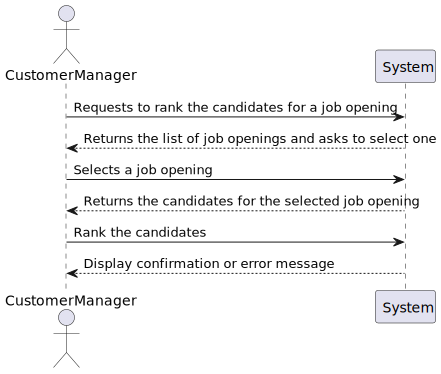
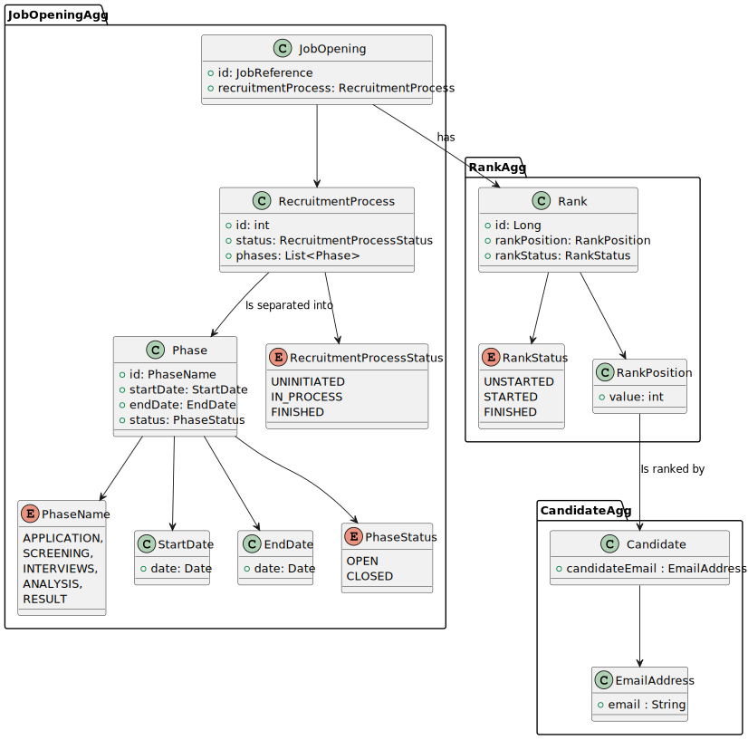

# US1013 - Rank the Candidates for a Job Opening

## 1. Requirements Engineering

### 1.1. User Story Description

As a Customer Manager, I want to rank the candidates for a job opening.

### 1.2. Customer Specifications and Clarifications

- Customer Specification:
  - The system must allow the Customer Manager to rank candidates for a job opening.
  - The fact that there are no interviews has no bearing on the ranking of candidates, as this does not explicitly depend on interviews.
  - The ranking should be recorded and stored for each candidate.
  - After ranking all candidates, the rankings should be available for analysis in the subsequent phases.

- Clarifications:
  - Ranking candidates involves assigning a position in a ranked list based on several criteria.
  - The Customer Manager is responsible for analyzing applications and deciding the ranking of candidates.
  - The Customer Manager performs the ranking during the analysis phase using all available information, including CVs and interview results if applicable.
  - The ranking process should allow the Customer Manager to stop and continue later if needed.
  - The Customer Manager can change the rank of a candidate if none of the interested parties were yet notified of the results.

### Recruitment Process Phases

| Phase        | Description                                                                                                      |
|--------------|------------------------------------------------------------------------------------------------------------------|
| Application  | Candidates submit their applications.                                                                            |
| Screening    | Applications are verified against a set of requirements. Applications not meeting the requirements are rejected. |
| Interviews   | (Optional) Accepted candidates may be interviewed. Results are recorded for further analysis.                    |
| Analysis     | Applications are analyzed using all available information. Candidates are ranked based on this analysis.         |
| Result       | Candidates and customers are notified of the final results.                                                      |

### 1.3. Acceptance Criteria

- Criteria:
  - All candidates must be ranked before moving to the next phase (it just runs in another US).
  - Ranking is not automatic and requires the Customer Manager to manually assign positions to candidates.

### 1.4. Identified Dependencies

- Dependencies:
  - Register an application of a candidate for a job opening
  - Ensure user authentication and authorization to allow only the Customer Manager to rank candidates.
  - Candidates must have completed the previous phases before they can be ranked.
  - Execute the process of verification of requirements of applications for a job opening.

### 1.5 Input and Output Data

- Input Data:
  - Option to select a job opening
  - Ranks the candidate

- Output Data:
  - List of job openings
  - List of candidates
  - Confirmation or error message

### 1.6. System Sequence Diagram (SSD)

Description:
- The SSD shows the sequence of interactions between the Customer Manager and the system to rank the candidates for a job opening.
- The Customer Manager selects a job opening and ranks the candidates.

### 1.7 Other Relevant Remarks

- *Remarks*:
  - The ranking process should be straightforward and intuitive to use.
  - The system should provide feedback to the Customer Manager if any issues are encountered during the ranking process.
  - The ranking process should be secure and ensure that only authorized users can access and modify the rankings.

## 2. OO Analysis

### 2.1. Relevant Domain Model Excerpt

