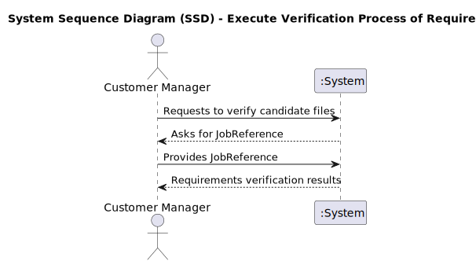
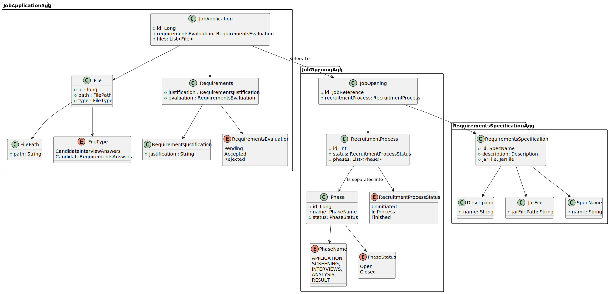
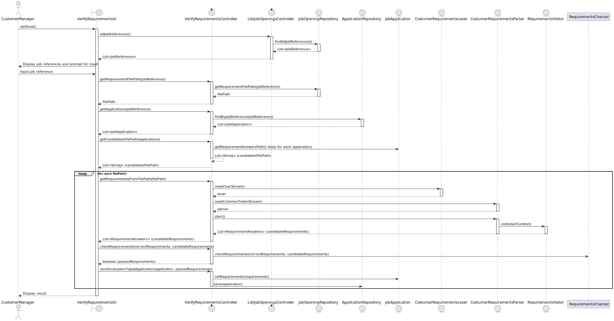
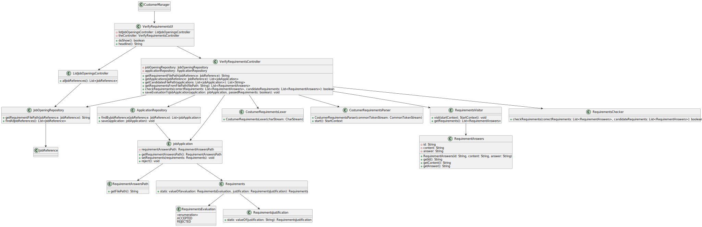

# US1015 - Execute Verification Process for Job Opening Applications

## 1. Requirements Engineering

### 1.1. User Story Description

As a Customer Manager, I want to execute the process of verification of requirements of applications for a job opening to ensure that all candidates meet the necessary criteria before proceeding to the next phase.

### 1.2. Customer Specifications and Clarifications

- **Customer Specification**:
    - The system must allow the Customer Manager to execute a verification process that checks if candidates meet the predefined requirements[Requirement Specification] for a job opening.
    - The verification process should validate the answers submitted by candidates against the requirements specified by the customer.
    - The system should provide a clear indication of which candidates are accepted or rejected based on the verification results.
    - The results of the verification process should be stored in the system.

- **Clarifications**:
    - The Customer Manager is responsible for initiating the verification process once the candidate's requirements files are uploaded and registered in the system.
    - The process will check each candidate's file against the job requirements and mark them as "Accepted" or "Rejected".
    - The verification process must be executed for all candidates who have submitted their requirements files.
    - The verification results are used to update the status of candidates, which can then be used to notify them of their application status through the subsequent user story (US1016).

### 1.3. Acceptance Criteria

- **Criteria**:
    - The Customer Manager can successfully execute the verification process for a job opening.
    - The system accurately validates candidate files against the specified job requirements.
    - Candidates are marked as "Accepted" or "Rejected" based on the verification results.
    - The system stores the verification results and updates the status of each candidate.
    - The verification process can handle files being uploaded progressively and verify them as they come in.

### 1.4. Identified Dependencies

- **Dependencies**:
    - Job openings must have a Requirement Specification assigned (US1009)
    - Candidate´s Requirements   must be uploaded and registered by the Operator (US2003 and US2004).
  
### 1.5 Input and Output Data

- **Input Data**:
    - Job Reference
    - Candidate requirements files

- **Output Data**:
    - Verification results indicating whether each candidate is "Accepted" or "Rejected"
    - Updated candidate statuses in the system,

---

### 1.6. System Sequence Diagram (SSD)

_Insert here a SSD depicting the envisioned Actor-System interactions and throughout which data is inputted and outputted to fulfill the requirement. All interactions must be numbered._

### 1.7 Other Relevant Remarks

_Use this section to capture other relevant information that is related with this US such as:  
&nbsp; &nbsp; (i) special requirements;  
&nbsp; &nbsp; (ii) data and/or technology variations;  
&nbsp; &nbsp; (iii) how often this US is held._

## 2. OO Analysis

### 2.1. Relevant Domain Model Excerpt

### 2.2. Other Remarks

_Use this section to capture some aditional notes/remarks that must be taken into consideration into the design activity. In some case, it might be usefull to add other analysis artifacts (e.g. activity or state diagrams)._

## 3. Design - User Story Realization

### 3.1. Rationale

Claro, aqui está uma versão mais concisa do rationale, focando-se nos passos mais importantes da lógica das user stories:

### Interaction Rationale

| Interaction ID | Question: Which class is responsible for...              | Answer                        | Justification (with patterns)                                                                            |
|:---------------|:---------------------------------------------------------|:------------------------------|:---------------------------------------------------------------------------------------------------------|
| Step 1         | User initiates the requirements verification process     | `VerifyRequirementsUI`        | **Pure Fabrication**: The UI component initiates the requirements verification process.                  |
| Step 2         | Requesting job references                                | `ListJobOpeningsController`   | **Controller**: The controller requests job references from the repository.                              |
| Step 3         | Finding job references                                   | `JobOpeningRepository`        | **Information Expert**: The repository has the data needed to find job references.                        |
| Step 4         | Displaying job references and prompting for input        | `VerifyRequirementsUI`        | **Pure Fabrication**: Displays the job references to the user and prompts for input.                     |
| Step 5         | Getting the requirement file path                        | `VerifyRequirementsController`| **Controller**: Coordinates the retrieval of the requirement file path for the job reference.            |
| Step 6         | Retrieving the requirement file path                     | `JobOpeningRepository`        | **Information Expert**: The repository retrieves the file path for the requirements.                     |
| Step 7         | Retrieving job applications                              | `VerifyRequirementsController`| **Controller**: Coordinates the retrieval of job applications for the job reference.                     |
| Step 8         | Finding applications by job reference                    | `ApplicationRepository`       | **Information Expert**: The repository finds applications related to the job reference.                  |
| Step 9         | Getting candidates' file paths                           | `VerifyRequirementsController`| **Controller**: Coordinates the retrieval of candidates' file paths from job applications.               |
| Step 10        | Extracting requirement answers from file paths           | `VerifyRequirementsController`| **Controller**: Coordinates the parsing and extraction of requirement answers from the provided file paths.|
| Step 11        | Parsing the file using lexer and parser                  | `CostumerRequirementsLexer`   | **Pure Fabrication**: Creates a lexer for parsing the file content.                                      |
| Step 12        | Parsing the file using lexer and parser                  | `CostumerRequirementsParser`  | **Pure Fabrication**: Creates a parser for parsing the token stream.                                     |
| Step 13        | Visiting the parse tree                                  | `RequirementsVisitor`         | **Visitor**: Traverses the parse tree to extract the requirement answers.                                |
| Step 14        | Checking the requirements                                | `VerifyRequirementsController`| **Controller**: Coordinates the checking of candidate requirements against correct requirements.         |
| Step 15        | Verifying requirements                                   | `RequirementsChecker`         | **Information Expert**: The checker verifies the requirements and returns the result.                    |
| Step 16        | Saving the evaluation to job application                 | `VerifyRequirementsController`| **Controller**: Coordinates the saving of the evaluation result to the job application.                  |
| Step 17        | Updating the job application                             | `jobApplication`              | **Information Expert**: The job application updates its requirements based on the evaluation.            |
| Step 18        | Persisting the updated job application                   | `ApplicationRepository`       | **Information Expert**: The repository saves the updated job application.                                |
| Step 19        | Displaying the result                                    | `VerifyRequirementsUI`        | **Pure Fabrication**: Displays the verification result to the user.                                      |

### Systematization ##

According to the taken rationale, the conceptual classes promoted to software classes are:

[N/A]

Other software classes (i.e. Pure Fabrication) identified:

* `VerifyRequirementsUI`
* `VerifyRequirementsController`

## 3.2. Sequence Diagram (SD)

_In this section, it is suggested to present an UML dynamic view representing the sequence of interactions between software objects that allows to fulfill the requirements._

## 3.3. Class Diagram (CD)

_In this section, it is suggested to present an UML static view representing the main related software classes that are involved in fulfilling the requirements as well as their relations, attributes and methods._

# 4. Tests
_In this section, it is suggested to systematize how the tests were designed to allow a correct measurement of requirements fulfilling._

**_DO NOT COPY ALL DEVELOPED TESTS HERE_**

**Test 1:** Check that it is not possible to create an instance of the Example class with null values.

	@Test(expected = IllegalArgumentException.class)
		public void ensureNullIsNotAllowed() {
		Exemplo instance = new Exemplo(null, null);
	}

_It is also recommended to organize this content by subsections._

# 5. Construction (Implementation)

_In this section, it is suggested to provide, if necessary, some evidence that the construction/implementation is in accordance with the previously carried out design. Furthermore, it is recommeded to mention/describe the existence of other relevant (e.g. configuration) files and highlight relevant commits._

_It is also recommended to organize this content by subsections._

# 6. Integration and Demo

_In this section, it is suggested to describe the efforts made to integrate this functionality with the other features of the system._

# 7. Observations

_In this section, it is suggested to present a critical perspective on the developed work, pointing, for example, to other alternatives and or future related work._