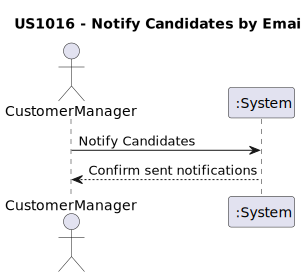
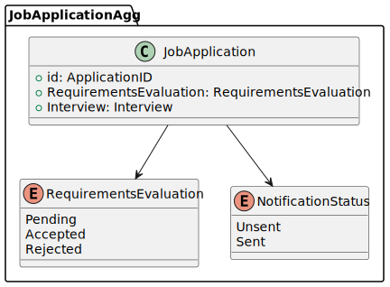

# US1016 - Notify Candidates by Email

## 1. Requirements Engineering

### 1.1. User Story Description

**As a Customer Manager, I want the system to notify candidates by email of the result of the verification process.**

### 1.2. Customer Specifications and Clarifications

- **Q164 Alejandro:** The format of the message to be sent can be in Portuguese or English.
- **Q48 Beatriz:** While not explicitly stated, it is appropriate to record that email notifications have been sent for process management.
- **Q69 Silva:** The Customer Manager is responsible for informing the candidate through the system of the verification result after invoking the verification process.
- **Q209 Vieira:** The "verification process" refers to the screening phase.
- **Q210 Leite:** An error in the notification process does not invalidate the results of the verification process.
- **Q119 Caracol:** The Customer Manager executes the verification process and the notification of the results.

### 1.3. Acceptance Criteria

- The system must allow the Customer Manager to send email notifications to candidates regarding the verification results.
- The system must record that the notifications were sent.
- The notifications can be sent in either Portuguese or English.

### 1.4. Found out Dependencies

- **US1015 - Verification Process:** The notification process (US1016) must be executed after the verification process (US1015) is completed.

### 1.5 Input and Output Data

**Input Data:**
- Choose to send notifications to candidates

**Output Data:**
- Confirm that notifications have been sent to candidates

### 1.6. System Sequence Diagram (SSD)

### 1.7 Other Relevant Remarks

- The system must support both Portuguese and English for email notifications.
- Notifications are managed by the Customer Manager and not automatically triggered.
- Errors in the notification process do not affect the verification results.

## 2. OO Analysis

### 2.1. Relevant Domain Model Excerpt

### 2.2. Other Remarks

- The design must ensure that the notification process can handle both successful and failed email deliveries.

## 3. Design - User Story Realization

### 3.1. Rationale

Certainly! Below is the rationale table based on the provided documentation for the US1016 - Notify Candidates by Email:

| Interaction ID | Question: Which class is responsible for...        | Answer                 | Justification (with patterns)                                                                                                            |
|----------------|----------------------------------------------------|------------------------|------------------------------------------------------------------------------------------------------------------------------------------|
| 1              | ...initiating the notification process?            | CustomerManager        | The CustomerManager triggers the notification process, as indicated by the user story and requirements.                                  |
| 2              | ...sending the email notifications?                | NotificationService    | The NotificationService handles the actual sending of emails, aligning with the Service pattern.                                         |
| 3              | ...recording that notifications were sent?         | NotificationService    | The NotificationService is responsible for recording the sent notifications, consistent with the Single Responsibility Principle (SRP).  |
| 4              | ...providing the user interface for notifications? | NotificationUI         | The NotificationUI manages the user interface aspects of the notification process, adhering to the Model-View-Controller (MVC) pattern.  |
| 5              | ...controlling the notification process flow?      | NotificationController | The NotificationController controls the process flow, coordinating between the UI and the service layer, fitting the Controller pattern. |

### Systematization

According to the taken rationale, the conceptual classes promoted to software classes are:

* NotificationService

Other software classes (i.e., Pure Fabrication) identified:

* NotificationUI
* NotificationController