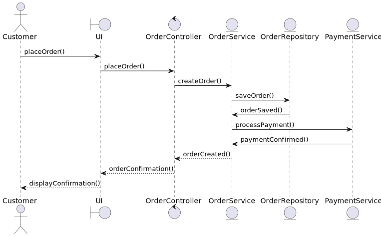
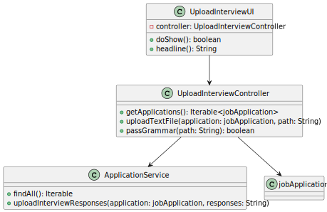

# US1017 - Upload Candidate Interview Answers

## 1. Requirements Engineering

### 1.1. User Story Description

As a Customer Manager, I want to upload a text file with the candidate responses for an interview.

### 1.2. Customer Specifications and Clarifications

- **Customer Specification**:
    - The system must allow the Customer Manager to upload a text file with the candidate's responses for an interview.
    - The text file must be validated against the defined grammar to ensure it follows the expected format.
    - If the file format is invalid, the system must reject the upload and request a valid file from the user.
    - If the file is in the correct format, its content must be imported into the system for later use (e.g., in US1018).
    - The file must be stored securely, ideally integrated into the database, or, if not possible, in a secure server directory.

- **Clarifications**:
    - Validation errors, such as numeric answers filled with letters, should be considered format errors and lead to file rejection in US1017.
    - Syntax must be verified at the time of upload. If everything is correct, the file should be "imported" into the system for later use.
    - The imported file must be stored securely, preferably in the database, or in a secure server directory if the database is not feasible.

### 1.3. Acceptance Criteria

- **Criteria**:
    - The Customer Manager can upload a text file with the candidate's interview responses.
    - The system verifies the file format according to the defined grammar.
    - The system rejects files that are not in the correct format and provides feedback to the user.
    - The system imports the content of the valid file into the system for later use.
    - The imported file is stored securely, preferably in the database.

### 1.4. Identified Dependencies

- **Dependencies**:
    - The defined grammar to validate the file format.
    - The storage system for the imported files.
    - The file upload process must be available and functional.
    - The file import process must be integrated with the subsequent evaluation system (US1018).
    - Authentication and authorization support to ensure that only the Customer Manager can upload response files.

### 1.5 Input and Output Data

- **Input Data**:
    - Text file with the candidate's interview responses.

- **Output Data**:
    - Confirmation that the file was successfully uploaded and imported.
    - Error messages and feedback if the file is in an invalid format.

### 1.6. System Sequence Diagram (SSD)

**Description**:
- The SSD shows the interaction between the Customer Manager and the system when uploading a candidate's interview answers file.
- The sequence should start with the Customer Manager's request and end with the system's confirmation or error of the file upload.

### 1.7 Other Relevant Remarks

- **Remarks**:
    - Ensure the file format validation is robust to prevent errors during upload.
    - Ensure the file import is done securely and the data is stored appropriately for later use.

## 2. OO Analysis

### 2.1. Relevant Domain Model Excerpt

#### Description
- The domain model illustrates the `JobOpening` aggregate and its relationship with the phases of the recruitment process, including the interview phase and candidate responses.
- Each `JobOpening` can have multiple phases, which follow a defined sequential order.
- The interview phase (`InterviewPhase`) is an extension of the phase (`Phase`) and includes specific interviews (`Interview`).
- Each `Interview` is associated with a `Candidate` and includes a list of `InterviewQuestions` and `InterviewAnswers`.
- The responses (`InterviewAnswer`) are associated with specific questions (`InterviewQuestion`) and include the candidate's response and the obtained score.

### 2.2. Other Remarks

- **Remarks**:
    - Ensure that the candidate responses are correctly stored and can be used for subsequent evaluation.
    - Ensure that phase status changes are immediately reflected in the system and visible to relevant actors (Customer Manager and potentially Admin).
    - Phase transitions must be managed without overlaps; each phase must be closed before the next can be opened.

This completes the documentation for US1017 based on the provided template and the requirements from the client.

## 3. Design - User Story Realization

### 3.1. Rationale

**The rationale grounds on the SSD interactions and the identified input/output data.**

| Interaction ID | Question: Which class is responsible for... | Answer | Justification (with patterns) |
|:---------------|:--------------------------------------------|:-------|:------------------------------|
| Step 1         |                                             |        |                               |
| Step 2         |                                             |        |                               |
| Step 3         |                                             |        |                               |
| Step 4         |                                             |        |                               |
| Step 5         |                                             |        |                               |
| Step 6         |                                             |        |                               |
| Step 7         |                                             |        |                               |
| Step 8         |                                             |        |                               |
| Step 9         |                                             |        |                               |
| Step 10        |                                             |        |                               |

### Systematization ##

According to the taken rationale, the conceptual classes promoted to software classes are:

* Class1
* Class2
* Class3

Other software classes (i.e. Pure Fabrication) identified:

* xxxxUI
* xxxxController

## 3.2. Sequence Diagram (SD)

_In this section, it is suggested to present an UML dynamic view representing the sequence of interactions between software objects that allows to fulfill the requirements._

## 3.3. Class Diagram (CD)

_In this section, it is suggested to present an UML static view representing the main related software classes that are involved in fulfilling the requirements as well as their relations, attributes and methods._

# 4. Tests
_In this section, it is suggested to systematize how the tests were designed to allow a correct measurement of requirements fulfilling._

**_DO NOT COPY ALL DEVELOPED TESTS HERE_**

**Test 1:** Check that it is not possible to create an instance of the Example class with null values.

	@Test(expected = IllegalArgumentException.class)
		public void ensureNullIsNotAllowed() {
		Exemplo instance = new Exemplo(null, null);
	}

_It is also recommended to organize this content by subsections._

# 5. Construction (Implementation)

_In this section, it is suggested to provide, if necessary, some evidence that the construction/implementation is in accordance with the previously carried out design. Furthermore, it is recommeded to mention/describe the existence of other relevant (e.g. configuration) files and highlight relevant commits._

_It is also recommended to organize this content by subsections._

# 6. Integration and Demo

_In this section, it is suggested to describe the efforts made to integrate this functionality with the other features of the system._

# 7. Observations

_In this section, it is suggested to present a critical perspective on the developed work, pointing, for example, to other alternatives and or future related work._