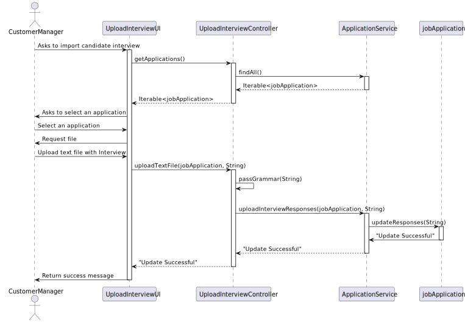
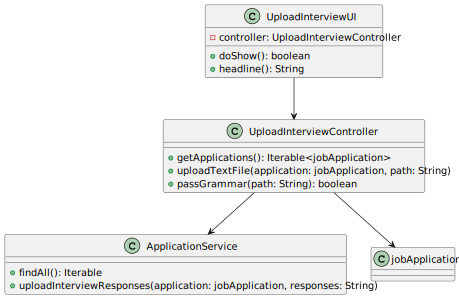

# US1017 - Upload Candidate Interview Answers

## 1. Requirements Engineering

### 1.1. User Story Description

As a Customer Manager, I want to upload a text file with the candidate responses for an interview.

### 1.2. Customer Specifications and Clarifications

- **Customer Specification**:
    - The system must allow the Customer Manager to upload a text file with the candidate's responses for an interview.
    - The text file must be validated against the defined grammar to ensure it follows the expected format.
    - If the file format is invalid, the system must reject the upload and request a valid file from the user.
    - If the file is in the correct format, its content must be imported into the system for later use (e.g., in US1018).
    - The file must be stored securely, ideally integrated into the database, or, if not possible, in a secure server directory.

- **Clarifications**:
    - Validation errors, such as numeric answers filled with letters, should be considered format errors and lead to file rejection in US1017.
    - Syntax must be verified at the time of upload. If everything is correct, the file should be "imported" into the system for later use.
    - The imported file must be stored securely, preferably in the database, or in a secure server directory if the database is not feasible.

### 1.3. Acceptance Criteria

- **Criteria**:
    - The Customer Manager can upload a text file with the candidate's interview responses.
    - The system verifies the file format according to the defined grammar.
    - The system rejects files that are not in the correct format and provides feedback to the user.
    - The system imports the content of the valid file into the system for later use.
    - The imported file is stored securely, preferably in the database.

### 1.4. Identified Dependencies

- **Dependencies**:
    - The defined grammar to validate the file format.
    - The storage system for the imported files.
    - The file upload process must be available and functional.
    - The file import process must be integrated with the subsequent evaluation system (US1018).
    - Authentication and authorization support to ensure that only the Customer Manager can upload response files.

### 1.5 Input and Output Data

- **Input Data**:
    - Text file with the candidate's interview responses.

- **Output Data**:
    - Confirmation that the file was successfully uploaded and imported.
    - Error messages and feedback if the file is in an invalid format.

### 1.6. System Sequence Diagram (SSD)

**Description**:
- The SSD shows the interaction between the Customer Manager and the system when uploading a candidate's interview answers file.
- The sequence should start with the Customer Manager's request and end with the system's confirmation or error of the file upload.

### 1.7 Other Relevant Remarks

- **Remarks**:
    - Ensure the file format validation is robust to prevent errors during upload.
    - Ensure the file import is done securely and the data is stored appropriately for later use.

## 2. OO Analysis

### 2.1. Relevant Domain Model Excerpt

#### Description

- The domain model illustrates the `Application` aggregate and its relationship with `Candidate`, `JobOpening`, and `File`.
- Each `Application` can have multiple associated `Files`, which represent the candidate's requirements and interview answers.
- The `Application` aggregate includes an `ApplicationState`, which tracks the status of the application. The state can be `SUBMITTED`, `IN_REVIEW`, `ACCEPTED`, or `REJECTED`.
- The `File` entity includes attributes for the file path, file type (such as Candidate Requirements or Interview Answers), and its content.
- The `Candidate` aggregate represents the individual applying for the job and includes attributes such as email, name, and phone number.
- The `JobOpening` aggregate represents the job the candidate is applying for and includes details like job reference, number of vacancies, job title, contract type, and description.

**Domain Model Changes**:
- The `Application` entity is associated with `File` entities that hold the candidate's requirements and interview answers. These files are validated for syntax and stored for later evaluation.
- The `Validator` component ensures the uploaded files comply with the defined grammar and syntax.
- The `FileRepository` component handles the storage and retrieval of these files.

### 2.2. Other Remarks

- **Remarks**:
  - Ensure that the `Application` entity is correctly associated with the uploaded files and that these files are validated and stored efficiently.
  - The syntax validation is crucial to ensure that the files meet the defined grammar before they are accepted and stored in the system.
  - Any errors in the file syntax should be reported back to the operator for correction and re-upload.

## 3. Design - User Story Realization

### 3.1. Rationale

**The rationale grounds on the SSD interactions and the identified input/output data.**

| Interaction ID | Question: Which class is responsible for... | Answer                                  | Justification (with patterns)                                                                  |
|:---------------|:--------------------------------------------|:----------------------------------------|:-----------------------------------------------------------------------------------------------|
| Step 1         | Request to upload candidate requirements file | `UploadCandidateRequirementsUI`          | The UI component collects the request from the user.                                            |
| Step 2         | Requesting candidate requirements file       | `UploadCandidateRequirementsUI`          | The UI component asks the user to provide the candidate requirements file.                     |
| Step 3         | Providing the candidate requirements file    | `Operator`                               | The operator provides the file to the UI component.                                             |
| Step 4         | Uploading candidate requirements file        | `UploadCandidateRequirementsController`  | The controller coordinates the upload request to the service layer.                             |
| Step 5         | Validating syntax of the file                | `RequirementsEvaluator`                  | The service validates the syntax of the provided file using ANTLR.                              |
| Step 6         | Storing the file path                        | `CandidateRequirementsService`           | The service stores the file path after successful validation.                                   |
| Step 7         | Saving the file path                         | `ApplicationRepository`                  | The repository persists the file path in the database.                                          |
| Step 8         | Confirming the upload success                | `UploadCandidateRequirementsController`  | The controller receives the confirmation and informs the UI.                                    |
| Step 9         | Displaying confirmation to the user          | `UploadCandidateRequirementsUI`          | The UI component displays the success message to the operator.                                  |

#### Systematization

According to the taken rationale, the conceptual classes promoted to software classes are:

- `Application`: The domain model class that represents the candidate's application, including the requirements file.
- `File`: The value object representing the file, including its path and type.
- `Candidate`: The domain model class representing the candidate associated with the application.

Other software classes (i.e., Pure Fabrication) identified:

- `UploadCandidateRequirementsUI`: The user interface component that allows the Operator to upload candidate requirements files.
- `UploadCandidateRequirementsController`: Coordinates the interaction between the UI, domain model, and service layer.
- `CandidateRequirementsService`: Handles the storage of the file path after validation.
- `ApplicationRepository`: Persists the file path and associated application details in the database.
- `RequirementsEvaluator`: Validates the syntax of the provided file using ANTLR.

## 3.2. Sequence Diagram (SD)

_In this section, it is suggested to present an UML dynamic view representing the sequence of interactions between software objects that allows to fulfill the requirements._

#### Interaction Steps

1. **Request to Upload File**:
  - The `Operator` requests to upload a candidate requirements file using the `UploadCandidateRequirementsUI`.

2. **Request Candidate Requirements File**:
  - The `UploadCandidateRequirementsUI` requests the candidate requirements file from the `Operator`.

3. **Provide Candidate Requirements File**:
  - The `Operator` provides the candidate requirements file to the `UploadCandidateRequirementsUI`.

4. **Submit File Path**:
  - The `UploadCandidateRequirementsUI` submits the file path to the `UploadCandidateRequirementsController`.

5. **Validate File Syntax**:
  - The `UploadCandidateRequirementsController` sends the file to the `RequirementsEvaluator` to validate its syntax.

6. **Return Validation Result**:
  - The `RequirementsEvaluator` returns the validation result (valid or invalid) to the `UploadCandidateRequirementsController`.

7. **Store File Path**:
  - If the file is valid, the `UploadCandidateRequirementsController` sends a request to store the file path to the `CandidateRequirementsService`.

8. **Save File Path**:
  - The `CandidateRequirementsService` sends the file path to the `ApplicationRepository` to save it.

9. **Confirm File Path Saved**:
  - The `ApplicationRepository` confirms the file path has been saved to the `CandidateRequirementsService`.

10. **Return Storage Confirmation**:
  - The `CandidateRequirementsService` returns the confirmation of file path storage to the `UploadCandidateRequirementsController`.

11. **Confirm Upload Success**:
  - The `UploadCandidateRequirementsController` confirms the upload success to the `UploadCandidateRequirementsUI`.

12. **Display Upload Success**:
  - The `UploadCandidateRequirementsUI` displays the upload success message to the `Operator`.

These interaction steps align with the system sequence diagram (SSD) provided and describe how the upload process should be handled by the various components of the system.

## 3.3. Class Diagram (CD)

_In this section, it is suggested to present an UML static view representing the main related software classes that are involved in fulfilling the requirements as well as their relations, attributes and methods._

# 4. Tests
_In this section, it is suggested to systematize how the tests were designed to allow a correct measurement of requirements fulfilling._

**_DO NOT COPY ALL DEVELOPED TESTS HERE_**

**Test 1:** Check that it is not possible to create an instance of the Example class with null values.

	@Test(expected = IllegalArgumentException.class)
		public void ensureNullIsNotAllowed() {
		Exemplo instance = new Exemplo(null, null);
	}

_It is also recommended to organize this content by subsections._

# 5. Construction (Implementation)

_In this section, it is suggested to provide, if necessary, some evidence that the construction/implementation is in accordance with the previously carried out design. Furthermore, it is recommeded to mention/describe the existence of other relevant (e.g. configuration) files and highlight relevant commits._

_It is also recommended to organize this content by subsections._

# 6. Integration and Demo

_In this section, it is suggested to describe the efforts made to integrate this functionality with the other features of the system._

# 7. Observations

_In this section, it is suggested to present a critical perspective on the developed work, pointing, for example, to other alternatives and or future related work._