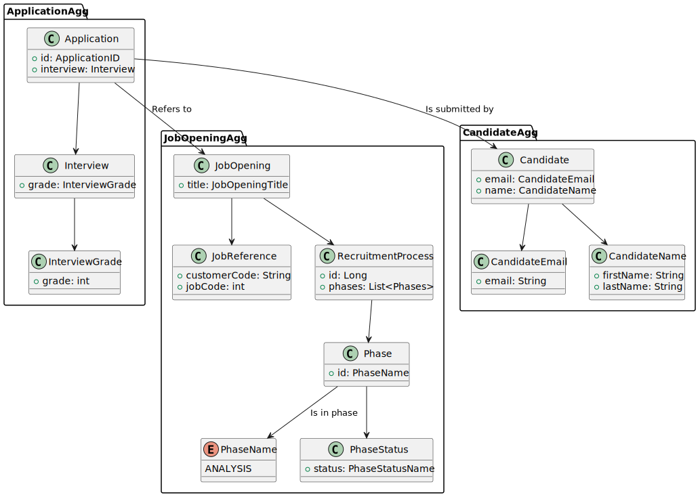
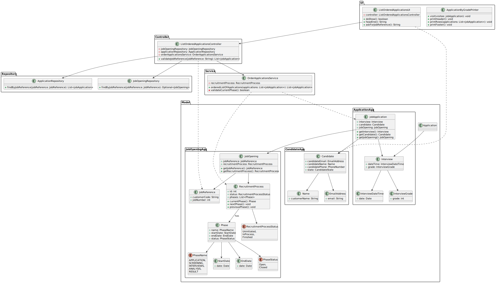

# US1019 - As Customer Manager, I want to get an ordered list of candidates, using the job interview points.

## 1. Requirements Engineering

### 1.1. User Story Description

As Customer Manager, I want to get an ordered list of candidates, using the job interview points (grades), to help me analyze the candidates.

### 1.2. Customer Specifications and Clarifications

**Question**: A lista que pretende é relacionada a uma job opening correto? A maneira de ordenação é ascendente ou quer uma opção que inclua ascendente e descendente?

**Answer**: Sim, a ordenação é relativa a candidaturas para um job opening. A ordenação deve ser descendente, do que tem maior pontuação para o que tem menor pontuação.

**Question**: A expressão "to help me analyze candidates" ,na descrição da user story , impõe que a job Opening esteja na fase de análise ?

**Answer**: Não vejo isso como uma obrigação, mas penso que faz mais sentido nessa fase admitindo que apenas nessa fase seja garantido que todas as entrevistas foram efetuadas e todos os candidatos “avaliados” pelas entrevistas.

**Other costumer specifications**:
    The list ordered should display the Candidate´s name, email and grade.
    We must consider only the Job Openings that have an Interview.

### 1.3. Acceptance Criteria

* The list should be available to the Customer Manager.
* Only order the list of candidates that have already been interviewed.
* The list should be ordered by the grade of the interview, from the highest to the lowest.
* The list should display the Candidate´s name, email and grade.

### 1.4. Found out Dependencies

US1013-"As Customer Manager, I want to rank the candidates for a job opening". 

US1013 depends on this US because the timeline for the ranking of the candidates is after the interview grades list.

### 1.5 Input and Output Data

_Identify here the data to be inputted by the system actor as well as the output data that the system has/needs to present in order to properly support the actor actions. Regarding the inputted data, it is suggested to distinguish between typed data and selected data (e.g. from a list)_

**Input Data**:
* Selected:
  * Job Reference

**Output Data**:

* List order of Candidate´s grades.
    * Candidate´s name
    * Candidate´s email
    * Candidate´s grade

### 1.6. System Sequence Diagram (SSD)

### 1.7 Other Relevant Remarks

Customer Manager should have 2 or more instances of the application running, so that he/she could, for instance, see the interviews grades and, at the same time, register the order/ranking of the candidates. Ref: Q163

## 2. OO Analysis

### 2.1. Relevant Domain Model Excerpt

### 2.2. Other Remarks

The phase of the Job Opening should be in "Analysis" phase to guarantee that all the interviews were done and all the candidates were evaluated by the interviews.

## 3. Design - User Story Realization

### 3.1. Rationale

**The rationale grounds on the SSD interactions and the identified input/output data.**

| Interaction ID | Question: Which class is responsible for... | Answer | Justification (with patterns) |
|:---------------|:--------------------------------------------|:-------|:------------------------------|
| Step 1         |                                             |        |                               |
| Step 2         |                                             |        |                               |
| Step 3         |                                             |        |                               |
| Step 4         |                                             |        |                               |
| Step 5         |                                             |        |                               |
| Step 6         |                                             |        |                               |
| Step 7         |                                             |        |                               |
| Step 8         |                                             |        |                               |
| Step 9         |                                             |        |                               |
| Step 10        |                                             |        |                               |

### Systematization ##

According to the taken rationale, the conceptual classes promoted to software classes are:

* Class1
* Class2
* Class3

Other software classes (i.e. Pure Fabrication) identified:

* xxxxUI
* xxxxController

## 3.2. Sequence Diagram (SD)

_In this section, it is suggested to present an UML dynamic view representing the sequence of interactions between software objects that allows to fulfill the requirements._

## 3.3. Class Diagram (CD)

_In this section, it is suggested to present an UML static view representing the main related software classes that are involved in fulfilling the requirements as well as their relations, attributes and methods._

# 4. Tests
_In this section, it is suggested to systematize how the tests were designed to allow a correct measurement of requirements fulfilling._

**_DO NOT COPY ALL DEVELOPED TESTS HERE_**

**Test 1:** Check that it is not possible to create an instance of the Example class with null values.

	@Test(expected = IllegalArgumentException.class)
		public void ensureNullIsNotAllowed() {
		Exemplo instance = new Exemplo(null, null);
	}

_It is also recommended to organize this content by subsections._

# 5. Construction (Implementation)

_In this section, it is suggested to provide, if necessary, some evidence that the construction/implementation is in accordance with the previously carried out design. Furthermore, it is recommeded to mention/describe the existence of other relevant (e.g. configuration) files and highlight relevant commits._

_It is also recommended to organize this content by subsections._

# 6. Integration and Demo

_In this section, it is suggested to describe the efforts made to integrate this functionality with the other features of the system._

# 7. Observations

_In this section, it is suggested to present a critical perspective on the developed work, pointing, for example, to other alternatives and or future related work._