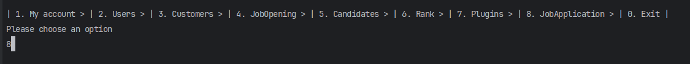
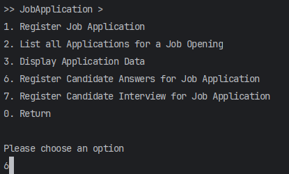
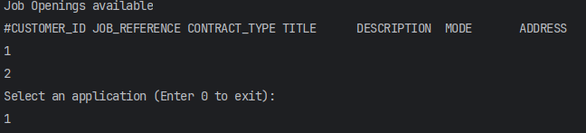
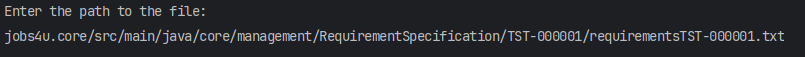
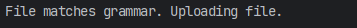

# US2004 - Upload a Text File with Candidate Data Fields for Verification

## 1. Requirements Engineering

### 1.1. User Story Description

As an Operator, I want to upload a text file with the data fields (requirements) of a candidate for its verification.

## Context
This task involves allowing the Operator to upload a text file with a candidate's requirements for their verification. In this us, an analysis is also done to verify that the file is syntactically correct, and only then can it be saved in the database. This task is prioritized as essential to expedite candidate verification.

### 1.2. Customer Specifications and Clarifications

- **Customer Specification**:
    - The system must allow the Operator to upload a text file containing the data fields of a candidate.
    - The operator has access to all the files submitted by the candidates.
    - The imported file is already filled in by the candidate.
    - The operator will "import" the file into the system, checking if it is syntactically correct, if it is not syntactically correct the file should be rejected

- **Clarifications**:
    - The file format should be standardized (e.g., CSV, TXT) to ensure consistency.
    - If any issues are encountered during verification, validation messages should be displayed to the Operator.

### Important Client information

-Q119 Caracol – Management of screening data - We have a question about the management of the screen phase of the recruitment process. Specifically, after the applications are filtered during the screening process, I'm unsure about who manages the results and oversees this phase. Could you please clarify if the responsibility for managing the screening results falls under the customer manager, the operators, or both?
-A119. In US2003 and US2004 it is the Operator that “downloads” a template file to register the requirements, registers the answers for the requirements in the file, and then uploads the file. It is then the Costumer manager that executes the verification process (US1015) and executes the notification of the results (US1016)

- Q166 Varela – US2004 - Requirements Answers - I'm having trouble understading where are the requirements answer obtained from the candidates, so that the operator can then register their answers in the template previously generated and submit them to the system. Are these answers already within the files processed by tge application fie bot?
- A166 Please see Q15, Q102, Q119 and Q123. We can assume that the operator has access to all the files submitted by the candidates (since he/she is the one that imports the files into the system – US2002). He/she can than consult these files in order to answer the questions in the requirements template file. She/he then submits the file with the answers (US2004).

- Q180 Varela – US2004 - Candidate Answers - Does US2004 only deals with the upload of the file to the system or also the registration of the candidate's answer by the Operator? I've seen many mentions about the file's answers but I want to understand if that aspect is also part of US2004.
- A180 In US2003 the Operator downloads a template file that he/she uses to register the candidate requirements. In US 2004, the Operator uploads a file with the requirements and the system should validate the file (verify of the syntax is correct). US 1015 is the one that executes the verification of requirements for the candidates (based on the previously uploaded files).

- Q223 Araújo – US 2004 – About the Us2004, in A180 you previously stated that "the Operator uploads a file with the requirements and the system should validate the file (verify of the syntax is correct). US 1015 is the one that executes the verification...". What should happen if the file failes this verification? Is the application instantly refused or do you have something else in mind?
- A223. A file that fails the verification means that that file has an error (syntactic error) it does not mean that the application does not meet the requirements. The user should fix the error and submit again. Only US 1015 results in approving or rejecting an application

### Recruitment Process Phases

| Phase        | Description                                                                                                      |
|--------------|------------------------------------------------------------------------------------------------------------------|
| Application  | Candidates submit their applications.                                                                            |
| Screening    | Applications are verified against a set of requirements. Applications not meeting the requirements are rejected. |
| Interviews   | (Optional) Accepted candidates may be interviewed. Results are recorded for further analysis.                    |
| Analysis     | Applications are analyzed using all available information. Candidates are ranked based on this analysis.         |
| Result       | Candidates and customers are notified of the final results.                                                      |

### 1.3. Acceptance Criteria

- **Criteria**:
    - The Operator can successfully upload a text file with candidate data fields.
    - Submitting the file means "importing" the file into the system, verifying that it is syntactically correct.
    - Validation messages should be displayed if any issues are encountered during the verification process.

### 1.4. Identified Dependencies

- **Dependencies**:
    - The job opening and its recruitment process must be registered in the system.
    - Create an application.
    - The file format and structure must be predefined.
    - Generates a template file with the data to be entered to validate an application. In US 2004, the Operator, after filling in the specific data of the application (based on the previous template file) submits this file to the system that will be used for the system to evaluate/verify the application.

his user story is a dependency for 2004,
- 1015 - As Customer Manager, I want to execute the process of verification of requirements of applications for a job opening.

### 1.5 Input and Output Data

- **Input Data**:
    - Text file with candidate data fields 

- **Output Data**:
    - List aplication
    - Upload Done Successfully or not.
  
### 1.6. System Sequence Diagram (SSD)

**Description**:
### Sequence Diagram Analysis

This sequence diagram describes the interaction between the operator and the system to upload a text file with the requirements

1 **Important Interactions:**

  - Depending on the validity of the file:
    - If the file is valid, the system records the upload and returns a success message to the operator.
    - If the file is invalid, the system returns an error message to the operator.

2 **Alternative Flow:**

  - The diagram uses an alternate structure (`alt`) to handle alternative flows based on the file's validity.

3 **Conclusion:**

  - Once the interaction is completed, the diagram ends, indicating the completion of the file upload process.

## 2. OO Analysis

### 2.1. Relevant Domain Model Excerpt

#### Description
- JobOpening refers to many Applications, indicating that a job opening can have multiple associated applications.
- Application refers to a Candidate, showing that each application is submitted by a candidate.
- Candidate refers to many Applications, showing that a candidate can submit multiple applications.
- JobOpening can refer to a RequirementsSpecification, indicating that a job opening can have a associated requirements specification.

## 3. Design - User Story Realization

### 3.1. Rationale

**The rationale grounds on the SSD interactions and the identified input/output data.**

| Interaction ID | Question: Which class is responsible for... | Answer                          | Justification (with patterns)                                                                  |
|:---------------|:--------------------------------------------|:--------------------------------|:-----------------------------------------------------------------------------------------------|
| Step 1         | User asks to import candidate response      | `UploadRequirementsUI`         | The UI component handles the request from the user to import candidate response.               |
| Step 2         | List applications for selection             | `UploadRequirementsController` | The controller retrieves the list of applications to present to the user.                       |
| Step 3         | Fetches  all applications                   | `ApplicationService`           | The service class fetches all applications for processing.                                       |
| Step 4         | User selects an application                 | `UploadRequirementsUI`         | The UI component prompts the user to select an application.                                      |
| Step 5         | User uploads a text file with requirements  | `UploadRequirementsUI`         | The UI component handles the user's action of uploading a text file with requirements.           |
| Step 6         | Handling the uploaded file                  | `UploadRequirementsController` | The controller receives the uploaded file and the selected application for processing.          |
| Step 7         | Processing the uploaded file                | `UploadRequirementsController` | The controller coordinates the processing of the uploaded file and its association with the application. |
| Step 8         | Updating application responses              | `ApplicationService`           | The service class updates the application responses with the content of the uploaded file.       |
| Step 9         | Notifying the user of success               | `UploadRequirementsController` | The controller notifies the UI component about the success of the update.                        |

### 3.2. Sequence Diagram (SD)

**Description**:
### Sequence Diagram Explanation

This sequence diagram illustrates the interaction between the Operator and the system components (`UploadRequirementsUI`, `UploadRequirementsController`, `ApplicationService`, and `jobApplication`) during the process of uploading a text file with the requirements

1. **Operator Interaction:**
  - The sequence begins with the Operator initiating the process by requesting to import candidate responses.

2. **Retrieving Applications:**
  - The `UploadRequirementsUI` calls getApplications() on the UploadRequirementsController to retrieve all available job applications.
  - 
3. **Fetching Applications:**
  - The `UploadRequirementsController` calls findAll() on ApplicationService to fetch all job applications.
  - `ApplicationService` returns a list of job applications to the Controller.

4. **Selecting an Application:**
  - The `UploadRequirementsUI` prompts the Operator to select an application.

5. **Uploading File Request:**
  - The Operator requests to upload a text file with requirements.

6. **File Upload Handling:**
  -`UploadRequirementsUI` calls uploadTextFile(application, path) on the Controller with the selected job application and file path.

7.**File Verification:**
  - The `UploadRequirementsController` checks the grammar and validity of the uploaded file using the `passGrammar()` method.

8. **Valid File Processing:**
If the grammar is valid: 
  - Controller calls uploadRequirementsResponses(application, path) on the Service to update the job application with the file path.
  - ApplicationService calls setRequirementAnswersPath(path) on the jobApplication entity.
  - jobApplication saves the updated entity.
  - Service confirms the update to the Controller.
  - Controller confirms the successful upload to the UI.
  - UploadRequirementsUI notifies CM of the successful upload.

9. **Invalid File Handling:**
  - If the file grammar is invalid, an error message is returned directly from the `UploadRequirementsController` to the `UploadRequirementsUI`, which then notifies the Operator.

## 3.3. Class Diagram (CD)

# 4. Tests

# Test Plan for UploadRequirementsController

## Objective
To verify the correct functionality of the `UploadRequirementsController` class, particularly the `passGrammar` method and the file upload process.

## Scope
Testing will cover the following aspects of the `UploadRequirementsController` class:
1. Grammar check with valid and invalid files.
2. File upload process with valid and invalid files.

## Tests

### 1. Grammar Check
- **Test Case:** Valid Grammar File
  - **Description:** Verify if a file with valid grammar passes the grammar check.
  - **Input:** Valid text file.
  - **Expected Outcome:** Method returns true.

- **Test Case:** Invalid Grammar File
  - **Description:** Verify if a file with invalid grammar fails the grammar check.
  - **Input:** Invalid text file.
  - **Expected Outcome:** Method returns false.

### 2. File Upload
- **Test Case:** Upload Valid File
  - **Description:** Verify the file upload process with a valid file.
  - **Input:** Valid text file.
  - **Expected Outcome:** File is successfully uploaded, and a success message is displayed.

- **Test Case:** Upload Invalid File
  - **Description:** Verify behavior when trying to upload an invalid file.
  - **Input:** Invalid text file.
  - **Expected Outcome:** File is not uploaded, and an error message indicating the invalid file is displayed.

## 6. Demonstration

