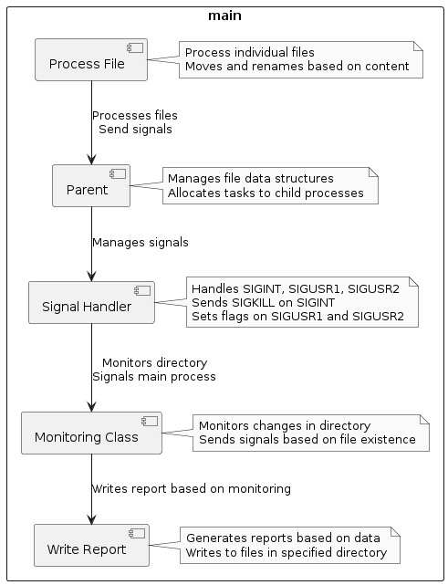

SCOMP - US 2001 As Product Owner, I want the system to, continuously, process the files
produced by the Applications Email Bot, so that they can be imported into the system
by initiative of the Operator
– Priority: 1
– References: See NFR12(SCOMP)

Descrição: A principal ideia desta User Story, é processar ficheiros entre diretórios. O programa irá ler ficheiros no diretório Email_bot (recebidos pelo Email File Bot) e processá-los até outro diretório. O diretório de output será nomeado através da primeira linha encontrada no candidate-data.txt (Job Reference) e depois dividido em subdiretórios baseados no prefixo do ficheiro. Para isso foram utilizados pipes e sinais.

Funcionalidades Implementadas da User Story:

Aqui estão algumas das funcionalidades implementadas:

    Processamento de Arquivos e Gerenciamento de Diretórios:
        Processos filhos são criados para lidar com tarefas específicas de processamento de arquivos, como mover arquivos baseados em uma convenção de nomes com prefixo e organizá-los em diretórios designados.
        Cada processo filho trabalha com arquivos dentro de um diretório dado, criando novos subdiretórios e colocando arquivos conforme necessário.

    Tratamento de Sinais:
        O sistema lida com sinais UNIX (SIGINT, SIGUSR1, SIGUSR2) para gerenciar a comunicação inter-processos e controlar comportamentos como terminar processos ou disparar ações específicas.

    Comunicação Interprocessos (IPC):
        Pipes são usados para coordenar e registar ações entre os processos pai e filho.
        Processos pais distribuem tarefas de processamento de arquivos entre os processos filhos e lidam com a alocação de tarefas de forma dinâmica com base na carga de trabalho.

    Monitoramento de Diretório:
        Um processo separado monitora o diretório em busca de novos arquivos e sinaliza o processo pai para reiniciar a distribuição de arquivos entre os processos filhos disponíveis quando novos arquivos são detectados.

    Tratamento de Erros e Relatórios:
        O sistema inclui tratamento abrangente de erros, o que garante a recuperação adequada de erros comuns como falhas na alocação de memória ou problemas de acesso ao sistema de arquivos.
        Erros e atividades do sistema são registrados em um diretório de saída especificado(File_Report).

Percentagem Funcional: 85%

Funcionalidades Incompletas e Problemas

    O programa apenas lê um ficheiro "candidate-data.txt" o que implica que seja criado apenas um diretório baseado na JobReference, porém a lógica dos prefixos em subdiretórios está a funcionar.
    Otimização de Desempenho: O método atual de distribuição e processamento de arquivos pode não ser otimizado para volumes muito altos de transações de arquivos, podendo levar a atrasos no desempenho.
    Tratamento de Erros Robusto: Embora um tratamento básico de erros esteja implementado, um gerenciamento mais sofisticado de casos extremos e falhas do sistema poderia melhorar a estabilidade.
    Escalabilidade: A escalabilidade do sistema é limitada pelo número fixo de processos filhos, que não se ajusta dinamicamente com base na intensidade da carga de trabalho ou nas capacidades do sistema.

Distribuição de Trabalho Realizado:

David Mendonça(1211572) - 25%
Diogo Nunes(1211895) - 25%
João Fernandes(1211681) - 25%
Rui Couto(1211497) - 25%